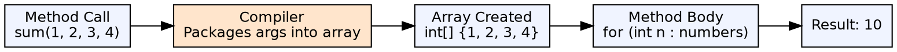
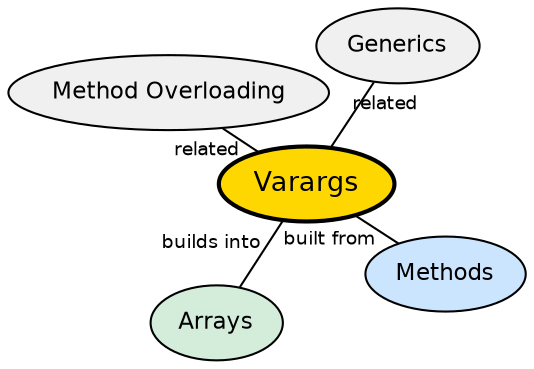

## The Problem

Some methods need to accept a variable number of arguments — for example, `String.format()`, `printf()`, or a sum function that should work with any number of inputs. Previous solutions (overloading for each arity, or passing arrays) are either verbose or force the caller to manually construct an array.

## Core Idea

**Varargs** (variable arguments) allow a method to accept zero or more arguments of a specified type using the ellipsis `...` syntax: `void method(int... numbers)`. Internally, the compiler converts the variable arguments into an array. Callers can pass individual arguments or an array directly.

## How It Works

When a varargs method is called, the compiler packages the variable arguments into an array of the specified type. Inside the method, the parameter is treated as an array — you can iterate over it, access elements by index, check its length, or pass it to other methods that accept arrays.

## Visual Explanation

## Semantic Network

## Key Properties

- **Must be last parameter**: Only one varargs parameter per method, and it must be the last
- **Zero arguments valid**: Calling `sum()` creates an empty array of length 0
- **Array compatible**: Callers can pass an array instead of individual arguments
- **Overloading caution**: Varargs methods have lowest priority in overload resolution

## Connections

- **Built from:** [[java-methods|Java Methods]] — varargs is a special kind of method parameter
- **Built from:** [[java-arrays|Java Arrays]] — varargs is syntactic sugar for array passing
- **Contrasts with:** [[java-methods|Java Methods]] — varargs avoids needing multiple overloads for different arities
- **Related:** [[java-program-structure|Java Program Structure]] — the `main` method's `String[] args` is conceptually similar

## Edge Cases & Gotchas

- **Ambiguous calls**: `method(null)` with varargs is ambiguous — could be null array or null first element
- **Generic varargs**: `@SafeVarargs` annotation suppresses heap pollution warnings
- **Performance**: Each call creates a new array — avoid in hot loops
- **Overriding**: Overriding a varargs method with a non-varargs method (or vice versa) is a compile error

## Sources

- [[java1-summary|Java Tutorial — Source Summary]] — varargs
