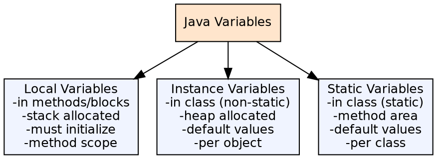
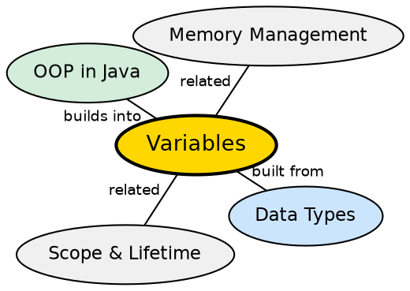

## The Problem

Programs need to store, read, and modify data throughout their execution. Without a clear variable system, developers would have no consistent way to declare where data lives, how long it persists, or who can access it — leading to memory conflicts, scoping bugs, and unpredictable behavior.

## Core Idea

A **variable** is a named memory location that holds a value of a specific type. Java distinguishes three kinds of variables: **local** (declared inside methods, lives on the stack), **instance** (declared in a class without static, one per object, lives on the heap), and **static** (declared with static, one per class, lives in the method area).

## How It Works

When a variable is declared, the compiler allocates memory according to its type and scope. Local variables exist only while the method executes and must be initialized before use. Instance variables are initialized to defaults (0, null, false) when the object is created. Static variables are initialized when the class is loaded and persist for the application's lifetime.

## Visual Explanation

## Semantic Network

## Key Properties

- **Local variables**: Must be explicitly initialized before use (no defaults)
- **Instance variables**: Default to 0/0.0/false/null for primitives and null for references
- **Static variables**: Same defaults as instance, but shared across all instances
- **Final variables**: `final` keyword makes a variable a constant — cannot be reassigned

## Connections

- **Built from:** [[java-data-types|Java Data Types]] — every variable has a declared type
- **Built from:** [[java-identifiers-and-keywords|Java Identifiers and Keywords]] — variable names follow identifier rules
- **Builds into:** [[java-methods|Java Methods]] — methods use variables for parameters and local computation
- **Contrasts with:** [[java-wrapper-classes|Java Wrapper Classes]] — variable types can be primitives or reference types

## Edge Cases & Gotchas

- **Local variable hiding**: A local variable can "shadow" a field with the same name
- **Default values are not zero for local variables** — the compiler rejects uninitialized locals
- **Blank final variables**: `final` instance variables can be left uninitialized if assigned in every constructor
- **Effectively final**: Variables that are not declared final but never reassigned are "effectively final" (used in lambdas)