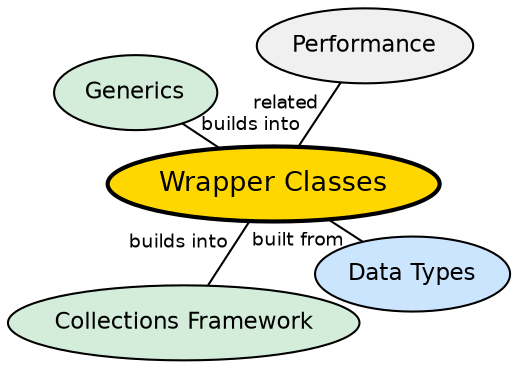

## The Problem

Java's type system has two worlds: primitives (int, boolean) and objects. Collections like `ArrayList` and `HashMap` can only store objects, not primitives. Similarly, generic types (`List<Integer>`) require object types. Without wrapper classes, developers would need to manually convert between primitive values and objects whenever using these APIs.

## Core Idea

**Wrapper classes** provide an object wrapper for each primitive type: `Integer` for `int`, `Boolean` for `boolean`, `Character` for `char`, and so on. Since Java 5, **autoboxing** and **unboxing** automatically convert between primitives and their wrappers, making the transition seamless.

## How It Works

When a primitive is assigned to a wrapper type (e.g., `Integer x = 42`), the compiler inserts code to call `Integer.valueOf(42)`. When a wrapper is used in a primitive context (e.g., `int y = x + 1`), the compiler inserts `x.intValue()`. The `valueOf()` methods for `Integer` and `Boolean` use caching for commonly used values.

## Visual Explanation

```dot
digraph java_wrappers {
  rankdir=LR
  node [shape=box style=filled fillcolor="#f0f4ff" fontname="Helvetica" fontsize=12]
  edge [fontname="Helvetica" fontsize=10]

  Prim [label="Primitive\nint x = 42" fillcolor="#ffe5cc"]
  AutoBox [label="Autoboxing\nx -> Integer.valueOf(42)"]
  Wrap [label="Wrapper\nInteger y = 42" fillcolor="#d4edda"]
  AutoUnbox [label="Unboxing\ny.intValue()"]
  Result [label="Primitive\nint z = x + y"]

  Prim -> AutoBox [label="assignment to wrapper"]
  AutoBox -> Wrap
  Wrap -> AutoUnbox [label="usage in expression"]
  AutoUnbox -> Result
}
```

## Semantic Network

## Key Properties

- **Eight wrapper classes**: `Byte`, `Short`, `Integer`, `Long`, `Float`, `Double`, `Boolean`, `Character`
- **Value caching**: `Integer` caches -128 to 127; `Boolean` caches `TRUE` and `FALSE`
- **Immutable**: Wrapper objects cannot be changed after creation
- **Utility methods**: `parseInt()`, `toString()`, `compareTo()`, `equals()`

## Connections

- **Built from:** [[java-data-types|Java Data Types]] — each wrapper corresponds to a primitive type
- **Builds into:** [[java-collections-framework|Java Collections Framework]] — collections require object types, enabled by wrappers
- **Related:** [[java-memory-management|Java Memory Management]] — wrappers live on the heap, primitives on the stack
- **Related:** [[java-strings|Java Strings]] — strings are also immutable objects with similar behavior patterns

## Edge Cases & Gotchas

- **== vs equals() for wrappers**: `new Integer(100) == new Integer(100)` is false (different objects)
- **NullPointerException**: Unboxing a null wrapper throws NPE: `Integer x = null; int y = x;` crashes
- **Performance penalty**: Autoboxing creates unnecessary objects in loops — use primitives for math-heavy code
- **Cache boundary**: `Integer.valueOf(200) != Integer.valueOf(200)` is true (outside cache range)

## Sources

- [[java1-summary|Java Tutorial — Source Summary]] — wrapper classes and autoboxing
