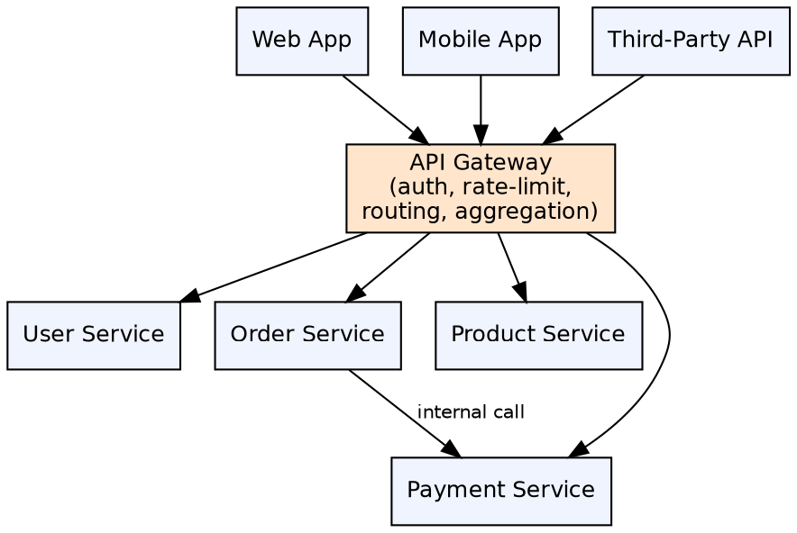

## The Problem

In a microservices architecture, clients (web, mobile, third-party) would need to know about every service, handle authentication individually, and orchestrate multiple service calls for a single page. This creates tight coupling between clients and backend services, duplicates security logic, and forces clients to manage network complexity.

## Core Idea

The API Gateway Pattern introduces a single entry point that routes client requests to the appropriate microservices. The gateway handles cross-cutting concerns — authentication, rate limiting, logging, request transformation — in one place. It can also aggregate responses from multiple services, reducing client-side complexity.

## How It Works

1. **Single entry point**: All client requests go through the gateway, not directly to services
2. **Route matching**: Gateway maps incoming request paths to target services — `GET /api/users/*` → User Service
3. **Authentication**: Gateway validates JWT tokens or API keys before forwarding requests — unauthenticated requests are rejected at the edge
4. **Rate limiting**: Gateway tracks request rates per client and throttles excessive requests
5. **Request/response transformation**: Gateway can modify headers, rewrite paths, transform request/response bodies
6. **Aggregation**: A single client request might trigger multiple downstream calls — gateway aggregates responses
7. **Backend for Frontend (BFF)**: Different gateways for different client types (web, mobile, IoT), each optimized for its client

## Visual Explanation

## Key Properties

- **Single entry point**: All external requests go through the gateway — simplifies client code
- **Authentication at edge**: Validate tokens/API keys once at gateway, not per service
- **Rate limiting**: Per-client rate limits prevent abuse and ensure fair usage
- **Request aggregation**: Combine multiple service responses into one client response
- **Protocol translation**: Gateway can translate between protocols (HTTP to gRPC, WebSocket polling)
- **Backend for Frontend (BFF)**: Separate gateways optimized for specific client types
- **Load shedding**: Gateway can reject requests under load to protect downstream services

## Connections

- **Built from:** [[spring-cloud-api-gateway|Spring Cloud API Gateway]] — Spring Cloud's implementation of the API Gateway pattern
- **Built from:** [[java-microservices|Java Microservices]] — API Gateway is a fundamental component of microservice architecture
- **Related:** [[spring-cloud-service-discovery|Spring Cloud Service Discovery]] — Gateway uses service discovery to route to instances
- **Related:** [[api-gateway-pattern|API Gateway Pattern]] — The general architectural pattern (self-reference)
- **Contrasts with:** [[ejb-object|EJB Object]] — EJB Object is a client-side proxy; API Gateway is a server-side entry point

## Edge Cases & Gotchas

- **Gateway SPOF**: If the gateway goes down, all requests fail — deploy multiple gateway instances behind a load balancer
- **Latency addition**: Every request passes through the gateway, adding network hops — keep gateway logic lightweight
- **Gateway bloat**: Avoid putting business logic in the gateway — it should only handle cross-cutting concerns
- **BFF vs single gateway**: Single gateway works for simple architectures; BFF scales better with diverse client requirements
- **WebSocket and gRPC**: Gateway must support non-HTTP protocols if services use WebSocket or gRPC

## Sources

- [[java3-summary|Advanced Java Tutorial — Source Summary]] — API Gateway pattern
