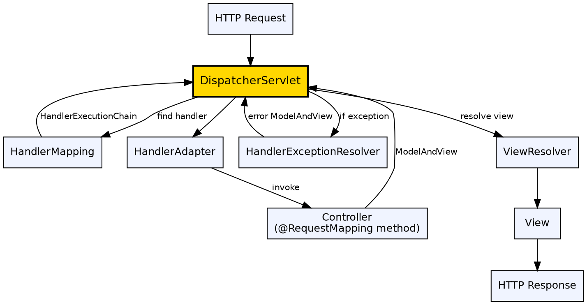

## The Problem

Without a central request-handling mechanism, every web page in an application manages its own request processing independently. This leads to duplicated infrastructure code (parameter parsing, security checks, view selection) scattered across pages, making the application hard to maintain and evolve.

## Core Idea

DispatcherServlet is Spring MVC's front controller — a single servlet that receives all HTTP requests and delegates to specialized components for each step of request processing. It acts as the central entry point, coordinating handler mapping, controller execution, exception handling, and view resolution.

## How It Works

1. **Request received**: All HTTP requests are mapped to DispatcherServlet in web.xml
2. **HandlerMapping lookup**: DispatcherServlet asks HandlerMapping to find the controller method matching the URL
3. **HandlerAdapter**: Adapter invokes the controller method, adapting to different controller types
4. **Controller executes**: Method processes the request, returns ModelAndView (or @ResponseBody)
5. **Exception resolution**: HandlerExceptionResolver catches controller exceptions and maps them to error views
6. **View resolution**: ViewResolver converts logical view name to actual view implementation
7. **View rendering**: View renders the model and sends the HTTP response

## Visual Explanation

## Key Properties

- **Front controller**: Single entry point for all web requests
- **Pluggable components**: HandlerMapping, HandlerAdapter, ViewResolver, ExceptionResolver all configurable
- **Default behavior**: Spring Boot auto-configures sensible defaults for all components
- **Servlet API independence**: Controllers don't directly depend on HttpServletRequest/Response
- **Integration**: Works with Spring Security's filter chain seamlessly

## Connections

- **Built from:** [[spring-mvc|Spring MVC]] — DispatcherServlet is the core of Spring MVC
- **Built from:** [[spring-framework|Spring Framework]] — DispatcherServlet is a Spring-managed bean wired via IoC
- **Related:** [[spring-controller|Spring Controller]] — Controllers are the handlers that DispatcherServlet invokes
- **Related:** [[spring-mvc-exception-handling|Spring MVC Exception Handling]] — HandlerExceptionResolver integrates with DispatcherServlet
- **Contrasts with:** [[ejb-object|EJB Object]] — EJB Object is a proxy; DispatcherServlet is a front controller

## Edge Cases & Gotchas

- **Multiple DispatcherServlets**: Possible but rare — each defines its own application context, can't share beans
- **Static resources**: DispatcherServlet must be configured to pass through static resources (CSS, JS) — use `<mvc:resources>` or default servlet handler
- **404 without mapping**: No HandlerMapping match results in 404 — check servlet mapping URL patterns
- **Application context hierarchy**: DispatcherServlet creates its own WebApplicationContext (child of root context); only sees beans in its own context

## Sources

- [[java3-summary|Advanced Java Tutorial — Source Summary]] — DispatcherServlet in Spring MVC
