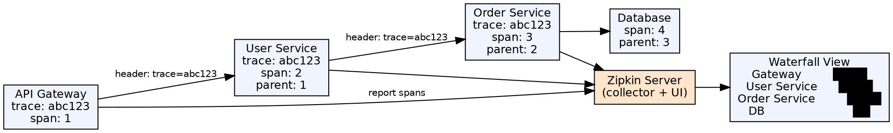

## The Problem

In a monolithic application, debugging a request is straightforward — one log file, one thread. In microservices, a single user request spans multiple services, each with its own logs, on different machines. When something fails, finding the root cause requires manually correlating log entries across services — a tedious, near-impossible task.

## Core Idea

Distributed tracing tracks a single request across multiple services by propagating a unique trace ID through every service call. Each service records spans (units of work) with timing, status, and metadata. A tracing system (Zipkin, Jaeger) collects and visualizes these spans, showing the full request path, timing breakdown, and errors.

## How It Works

1. **Trace ID generation**: When a request enters the system (at the API Gateway), a unique trace ID is generated
2. **Propagation**: The trace ID and span ID are propagated via HTTP headers (`X-B3-TraceId`, `X-B3-SpanId`) to downstream services
3. **Span recording**: Each service creates spans for the work it does — e.g., controller method, database query, HTTP call
4. **Annotation**: Spans include annotations for key events (client send, server receive, error)
5. **Collection**: Services send completed spans to a collector (Zipkin server) asynchronously
6. **Visualization**: The Zipkin UI shows a waterfall diagram: one row per span, with timing and parent-child relationships

## Visual Explanation

## Key Properties

- **Trace ID**: Unique identifier for an entire request across all services
- **Span**: A named, timed unit of work within a service (e.g., "SELECT from orders")
- **Parent span**: Spans form a tree — parent-child relationships show the call hierarchy
- **Propagation**: Trace context passed via HTTP headers (B3 format: X-B3-TraceId, X-B3-SpanId, X-B3-ParentSpanId)
- **Sampling**: Not every request is traced — sampling rate configurable (e.g., trace 10% of requests)
- **Visualization**: Zipkin Jaeger, or Grafana Tempo show trace timelines as waterfall diagrams

## Connections

- **Built from:** [[java-microservices|Java Microservices]] — Distributed tracing is essential when requests span multiple services
- **Related:** [[spring-cloud|Spring Cloud]] — Spring Cloud Sleuth (deprecated) / Micrometer Tracing provides auto-configuration
- **Related:** [[url-to-rendering-flow|URL to Rendering — Full Flow Analysis]] — Both trace end-to-end request flows
- **Contrasts with:** [[jta-jts|JTA and JTS]] — JTA propagates transaction context; tracing propagates trace context

## Edge Cases & Gotchas

- **Performance overhead**: Generating and reporting spans adds overhead — use sampling, especially at high throughput
- **Async boundaries**: Trace context doesn't propagate automatically across async boundaries — use `@Async` + trace context propagation
- **Sensitive data**: Spans may inadvertently capture sensitive data (SQL queries, request bodies) — sanitize span tags
- **Clock skew**: Services on different machines have slightly different clocks — Zipkin adjusts using client/server send/receive timestamps
- **End-to-end setup**: Requires all services to participate — one service without tracing breaks the trace chain

## Sources

- [[java3-summary|Advanced Java Tutorial — Source Summary]] — Distributed tracing with Zipkin
