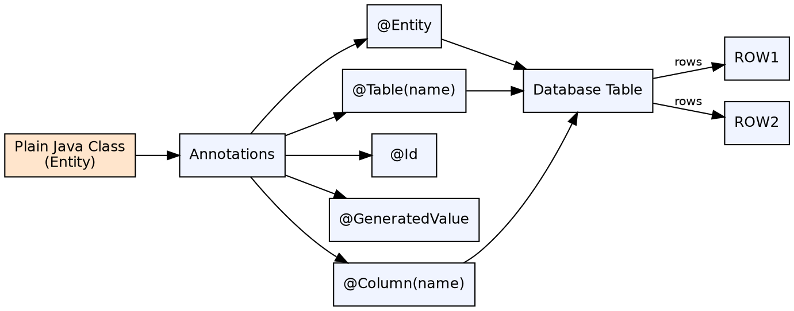

## The Problem

Early Hibernate used XML mapping files (.hbm.xml) to define how Java classes mapped to database tables. These files were verbose, hard to maintain, and separated the mapping definition from the code it described, making refactoring error-prone.

## Core Idea

Hibernate annotations allow developers to specify entity mappings directly in Java code using JPA-standard annotations. The most common annotations replace XML configuration with in-code metadata: `@Entity`, `@Table`, `@Id`, `@Column`, `@GeneratedValue`.

## How It Works

1. **`@Entity`**: Marks a POJO class as a Hibernate entity mapped to a database table
2. **`@Table(name)`**: Specifies the database table name (optional; defaults to class name)
3. **`@Id`**: Marks the primary key field
4. **`@GeneratedValue(strategy)**: Specifies primary key generation: AUTO, IDENTITY, SEQUENCE, TABLE
5. **`@Column(name, nullable, length)**: Maps a field to a column with optional constraints
6. **`@Transient`**: Marks a field that should NOT be persisted
7. **`@Temporal(TemporalType.DATE)**: Specifies date/time precision for java.util.Date fields
8. **`@Enumerated(EnumType.STRING)**: Specifies enum storage as STRING (name) or ORDINAL (index)

## Visual Explanation

## Key Properties

- **JPA-standard**: Annotations come from `javax.persistence.*` (or `jakarta.persistence.*`), not Hibernate-specific
- **Zero XML**: Full mapping can be done with annotations alone — no .hbm.xml files needed
- **Compile-time checked**: Wrong annotation usage is caught at compile time vs XML's runtime failures
- **Default conventions**: Unspecified mappings default to sensible conventions (table = class name, column = field name)
- **Hybrid possible**: Annotations can override or supplement XML configurations

## Connections

- **Built from:** [[hibernate-orm-framework|Hibernate ORM Framework]] — Annotations are the modern way to configure Hibernate
- **Built from:** [[object-relational-mapping|Object-Relational Mapping]] — Annotations map Java objects to relational tables
- **Related:** [[hibernate-entity-mapping|Hibernate Entity Mapping]] — Relationship annotations (@OneToOne, @OneToMany, @ManyToMany)
- **Contrasts with:** [[ejb-deployment-descriptor|EJB Deployment Descriptor]] — XML-based vs annotation-based configuration
- **Builds into:** [[spring-data-jpa|Spring Data JPA]] — Spring Data JPA entities use the same JPA annotations

## Edge Cases & Gotchas

- **Field vs property access**: `@Id` placement determines access strategy — on field (FIELD access) or getter (PROPERTY access); mixing causes issues
- **Default column names**: Auto-generated column names follow naming strategy; explicit `@Column(name)` avoids surprises
- **GenerationType.IDENTITY**: Disables batch inserts because the DB must generate the ID before Hibernate knows it
- **@Enumerated(ORDINAL)**: Default is ORDINAL (numeric), which breaks if enum ordering changes — prefer STRING

## Sources

- [[java3-summary|Advanced Java Tutorial — Source Summary]] — Hibernate annotations
