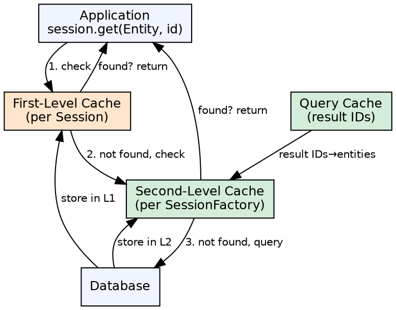

## The Problem

Database access is expensive — each query requires network round trips, SQL parsing, and disk I/O. Applications often read the same data multiple times within a short period. Without caching, every read hits the database, wasting resources and increasing latency.

## Core Idea

Hibernate provides a multi-level caching architecture: the first-level cache (mandatory, session-scoped) stores entities loaded within a single session; the second-level cache (optional, session-factory-scoped) is shared across sessions; the query cache caches query results and their entity identifiers.

## How It Works

1. **First-level cache**: Every Hibernate Session has its own cache. When `session.get()` loads an entity, Hibernate checks this cache first. If found, no database call. The cache is flushed (written to DB) at transaction commit or explicit `session.flush()`
2. **Second-level cache**: Pluggable cache (Ehcache, Redis, Infinispan) configured on the SessionFactory. When enabled for an entity, Hibernate checks L1 → L2 → database. L2 is shared across all sessions
3. **Query cache**: Caches query result identifiers (not entities). Requires second-level cache to be enabled. On re-execution, returns cached IDs and loads entities from L2 cache
4. **Cache concurrency strategies**: READ_ONLY (immutable data), READ_WRITE (frequent updates), NONSTRICT_READ_WRITE (rare updates), TRANSACTIONAL (full JTA support)

## Visual Explanation

## Key Properties

- **L1 cache**: Mandatory, session-scoped, cannot be disabled. Entities are removed when session is closed
- **L2 cache**: Optional, session-factory-scoped. Requires a cache provider (Ehcache, Redis)
- **Query cache**: Optional, caches query result identifiers, requires L2 cache
- **Cache regions**: Named regions allow fine-grained TTL and eviction policies per entity or query
- **Concurrency**: Four strategies (READ_ONLY, READ_WRITE, NONSTRICT_READ_WRITE, TRANSACTIONAL) matching data mutation patterns

## Connections

- **Built from:** [[hibernate-orm-framework|Hibernate ORM Framework]] — Caching is a built-in Hibernate feature
- **Related:** [[spring-orm|Spring ORM]] — Spring manages Hibernate sessions and transaction boundaries around caching
- **Contrasts with:** [[instance-pooling|Instance Pooling]] — Pooling caches bean instances; Hibernate caching caches database data
- **Related:** [[passivation|Passivation]] — Both are memory management strategies (passivation serializes, caching keeps in memory)
- **Builds into:** [[spring-data-jpa|Spring Data JPA]] — Spring Data JPA inherits Hibernate's caching when using Hibernate as JPA provider

## Edge Cases & Gotchas

- **L1 cache scope**: L1 cache only lives as long as the Session — in a stateless (stateless session) scenario, there is no L1 cache benefit
- **L2 cache invalidation**: Stale data occurs if another process modifies the database directly; use cache region timeouts
- **Query cache invalidation**: Any insert/update/delete on a cached query's table invalidates the entire query cache region
- **Cluster consistency**: Distributed L2 caches (Redis) need careful serialization and invalidation strategies
- **Debugging overhead**: Cached results hide database-level changes during development; always clear both caches during testing

## Sources

- [[java3-summary|Advanced Java Tutorial — Source Summary]] — Hibernate caching overview
