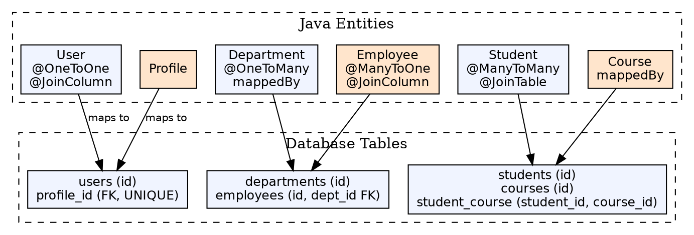

## The Problem

Relational databases model relationships using foreign keys and join tables, while Java models relationships using object references and collections. Translating between these paradigms — one-to-one, one-to-many, many-to-many — requires explicit mapping configuration so Hibernate knows how to persist object graphs.

## Core Idea

Hibernate entity mapping defines how Java class relationships correspond to database foreign key and join table structures. The three relationship types mirror SQL: `@OneToOne` (FK on either side), `@OneToMany`/`@ManyToOne` (FK on the many side), and `@ManyToMany` (join table).

## How It Works

1. **One-to-One (`@OneToOne`)**: A single entity instance relates to at most one other instance. Implemented via a foreign key column with a unique constraint on one table, or via a shared primary key
2. **One-to-Many (`@OneToMany` + `@ManyToOne`)**: One entity has many children. The child table holds the foreign key. The `@ManyToOne` side is always the owning side
3. **Many-to-Many (`@ManyToMany`)**: Each entity can relate to many of the other. Requires a join table with two foreign key columns. Both sides use `@JoinTable` with `joinColumns` and `inverseJoinColumns`
4. **Unidirectional vs Bidirectional**: Unidirectional means only one side navigates to the other; bidirectional means both sides have references

## Visual Explanation

## Key Properties

- **Owning side**: The side that owns the foreign key; only the owning side's changes are tracked
- **mappedBy**: Placed on the inverse (non-owning) side to reference the owning side's field name
- **Cascade**: Propagates operations (PERSIST, MERGE, REMOVE) from parent to child
- **Fetch type**: LAZY (load on access) vs EAGER (load immediately with parent)
- **Join columns**: `@JoinColumn` specifies the FK column name; `@JoinTable` specifies the join table for M:N
- **Inheritance mapping**: Single table, joined table, or table-per-class strategies for class hierarchies

## Connections

- **Built from:** [[hibernate-orm-framework|Hibernate ORM Framework]] — Mapping is a core feature of Hibernate
- **Built from:** [[object-relational-mapping|Object-Relational Mapping]] — Mapping implements ORM principles
- **Related:** [[hibernate-annotations|Hibernate Annotations]] — JPA annotations define mappings
- **Contrasts with:** [[one-to-one-relationship|One-to-One Relationship (EJB)]] — EJB's CMR vs Hibernate annotations
- **Builds into:** [[spring-data-jpa|Spring Data JPA]] — Spring Data JPA repositories operate on mapped entities

## Edge Cases & Gotchas

- **Bidirectional sync**: Always add convenience methods like `addEmployee(emp)` to sync both sides of bidirectional associations
- **equals/hashCode**: Never use the auto-generated ID in hashCode() before persisting — null ID causes inconsistent behavior in collections
- **EAGER fetch overuse**: Loading an entity with multiple EAGER collections creates a Cartesian product query
- **Join table naming**: If `@JoinTable` name is unspecified, Hibernate generates a default; explicit naming avoids surprises