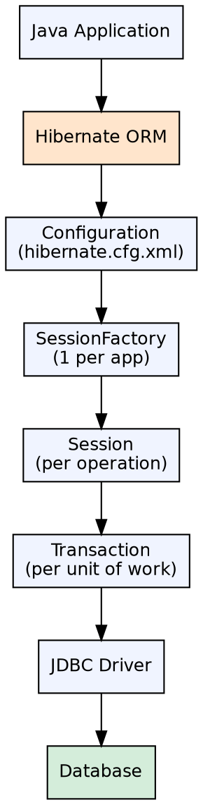
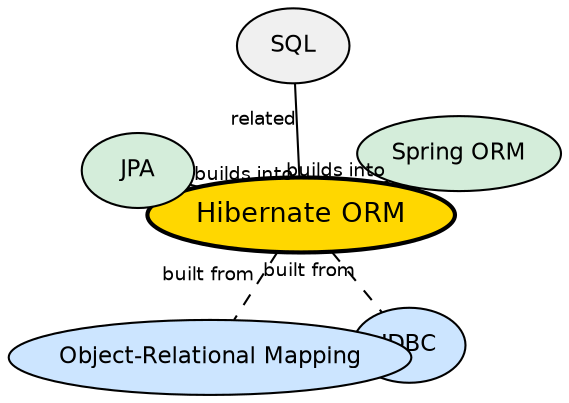

## The Problem

Writing raw JDBC code for every database operation is repetitive, error-prone, and mixes SQL with Java logic. Object-relational impedance mismatch means Java objects (graphs, inheritance) don't map naturally to relational tables (flat rows). Developers need a tool that automates this mapping and eliminates boilerplate.

## Core Idea

Hibernate is an Object-Relational Mapping (ORM) framework for Java that maps Java classes to database tables and provides automatic SQL generation for CRUD operations. Developers work with Java objects; Hibernate translates those operations into SQL statements transparently.

## How It Works

1. **Configuration**: A hibernate.cfg.xml file specifies database connection, dialect, and mapping classes
2. **SessionFactory**: A thread-safe factory created once per application from the configuration
3. **Session**: A lightweight, non-thread-safe wrapper around a JDBC connection, obtained per operation
4. **Transaction**: Wraps each unit of work. Hibernate uses its own Transaction API over JDBC transactions
5. **Persistence operations**: `session.save(obj)`, `session.get(Class, id)`, `session.update(obj)`, `session.delete(obj)` — Hibernate generates and executes the SQL
6. **Automatic dirty checking**: Hibernate tracks entity state changes and flushes updates to the database automatically

## Visual Explanation

## Semantic Network

## Key Properties

- **Automatic SQL**: Generates INSERT/UPDATE/DELETE/SELECT from object operations
- **Transparent persistence**: Developer works with POJOs, not JDBC
- **Caching**: First-level (session-scoped) and second-level (session-factory-scoped) cache
- **Lazy loading**: Child entities loaded from database only when accessed
- **HQL**: Object-oriented query language using class names instead of table names
- **Dialects**: Database-specific SQL generation (MySQL, Oracle, PostgreSQL, etc.)

## Connections

- **Built from:** [[java-jdbc|JDBC]] — Hibernate uses JDBC under the hood for database connectivity
- **Built from:** [[object-relational-mapping|Object-Relational Mapping]] — Hibernate implements ORM principles
- **Builds into:** [[spring-orm|Spring ORM]] — Spring integrates Hibernate via SessionFactory and transaction management
- **Builds into:** [[spring-data-jpa|Spring Data JPA]] — Spring Data JPA builds on Hibernate as the default JPA provider
- **Related:** [[hql|Hibernate Query Language]] — HQL is Hibernate's object-oriented query language
- **Contrasts with:** [[container-managed-persistence|Container-Managed Persistence]] — CMP is EJB's ORM approach; Hibernate is standalone

## Edge Cases & Gotchas

- **N+1 query problem**: Lazy loading a collection in a loop triggers N additional queries; use JOIN FETCH
- **Open Session in View**: Keeping a session open during view rendering can cause LazyInitializationException
- **equals() and hashCode()**: Must implement correctly for entities in collections, but primary keys change before persist
- **Version field**: Optimistic locking requires a `@Version` annotated field