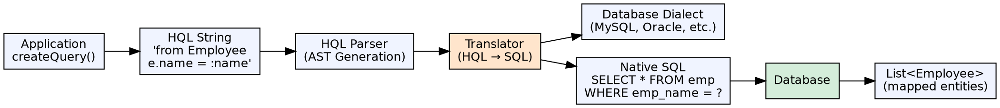

## The Problem

Standard SQL uses table and column names, making queries database-specific and tightly coupled to the physical schema. When using ORM, developers want to query using Java class and field names instead, maintaining the object-oriented abstraction even during queries.

## Core Idea

HQL (Hibernate Query Language) is an object-oriented query language that operates on entity class names and their fields instead of table and column names. HQL queries are translated by Hibernate into native SQL for the configured database dialect. Hibernate also supports Native SQL queries for database-specific features.

## How It Works

1. **HQL syntax**: `from Employee e where e.department.name = :deptName` — uses class and field names
2. **Query creation**: `session.createQuery("from Employee", Employee.class)`
3. **Parameter binding**: Named parameters (`:paramName`) or positional (`?1`) prevent SQL injection
4. **Translation**: Hibernate parses HQL, generates an AST, transforms it to SQL for the target dialect
5. **Result processing**: Returns `List<Entity>` or `Stream<Entity>` automatically mapped to entities
6. **Native SQL**: `session.createNativeQuery("SELECT * FROM emp", Employee.class)` for raw SQL

## Visual Explanation

## Key Properties

- **Object-oriented**: Queries use Java class names (`Employee`) and field names (`firstName`)
- **Dialect-independent**: Same HQL works on MySQL, Oracle, PostgreSQL — Hibernate handles translation
- **Named parameters**: `:name` syntax with `setParameter("name", value)` for safe parameter binding
- **Aggregation**: Supports `SELECT`, `GROUP BY`, `HAVING`, `ORDER BY`, aggregate functions
- **Joins**: Implicit path navigation (`emp.department.name`) and explicit JOIN FETCH for loading associations
- **Native SQL fallback**: `createNativeQuery()` for database-specific features, stored procedures, or complex queries

## Connections

- **Built from:** [[hibernate-orm-framework|Hibernate ORM Framework]] — HQL is Hibernate's query language
- **Built from:** [[ejb-ql|EJB Query Language (EJB-QL)]] — HQL is the ORM successor to EJB-QL's concept
- **Related:** [[java-jdbc|JDBC]] — Native SQL in Hibernate still uses JDBC under the hood
- **Builds into:** [[spring-data-jpa|Spring Data JPA]] — Spring Data JPA's @Query uses JPQL (similar to HQL)
- **Contrasts with:** [[ejb-ql|EJB-QL]] — EJB-QL is more limited, HQL supports richer expressions and native SQL

## Edge Cases & Gotchas

- **N+1 with joins**: Default fetching is LAZY; HQL queries without JOIN FETCH trigger N+1 queries for associations
- **HQL vs SQL mindset**: HQL operates on entities, not rows — `select e.firstName, e.lastName` returns `Object[]`, not entities
- **Positional parameters**: `?` positional params are deprecated in Hibernate 5+ in favor of `:named` parameters
- **Scalar queries**: Aggregate results need proper typing — `query.getSingleResult()` returns `Long` for COUNT, not `Integer`

## Sources

- [[java3-summary|Advanced Java Tutorial — Source Summary]] — HQL and Native SQL queries
