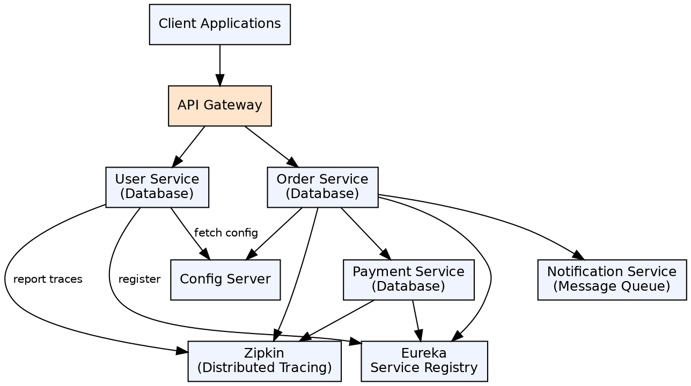

## The Problem

Monolithic applications grow too large to maintain — a single codebase with millions of lines, long build times, brittle deployments where one bug takes down the entire application. Scaling requires scaling the whole app, not just the bottleneck component. Teams can't work independently on different parts.

## Core Idea

Java Microservices is an architectural style where a Java application is structured as a collection of small, independently deployable services, each owning its own database and communicating via lightweight protocols (HTTP/REST or messaging). Each service is developed, deployed, and scaled independently, typically using Spring Boot.

## How It Works

1. **Service decomposition**: Each business capability becomes a separate service (User Service, Order Service, Payment Service)
2. **Independent deployment**: Each service is its own Spring Boot JAR, deployed separately, with its own CI/CD pipeline
3. **Inter-service communication**: Services communicate via REST APIs (synchronous) or message queues (asynchronous)
4. **Service discovery**: Eureka registry enables services to find each other by logical name
5. **API Gateway**: Single entry point routes requests to appropriate services
6. **Database per service**: Each service owns its database — no shared database across services
7. **Distributed tracing**: Sleuth + Zipkin trace requests across service boundaries for debugging

## Visual Explanation

## Key Properties

- **Independent deployability**: Each service has its own build, test, deploy pipeline
- **Decentralized data**: Each service owns its database — no shared schema, no cross-service transactions
- **Technology heterogeneity**: Each service can use different technology stacks (though in Java, all typically Spring Boot)
- **Resilience**: Failure in one service doesn't cascade — circuit breakers, fallbacks, bulkheads
- **Scalability**: Scale only the services that need it (e.g., more Order Service instances during sales)
- **Team autonomy**: Teams own their services end-to-end — development, testing, deployment, operations

## Connections

- **Built from:** [[spring-boot|Spring Boot]] — Each microservice is a Spring Boot application
- **Built from:** [[spring-cloud|Spring Cloud]] — Infrastructure (discovery, gateway, config, tracing) comes from Spring Cloud
- **Built from:** [[spring-boot-rest-api|Spring Boot REST API]] — Services communicate via REST APIs
- **Related:** [[api-gateway-pattern|API Gateway Pattern]] — Gateway is the entry point for all microservice requests
- **Related:** [[service-discovery-registry|Service Discovery and Registry]] — Eureka enables service-to-service discovery
- **Contrasts with:** [[backend-architecture|Backend Architecture]] — Monolithic vs microservices architecture tradeoffs

## Edge Cases & Gotchas

- **Distributed transactions**: No ACID across services — use Saga pattern (choreography or orchestration)
- **Network latency**: Inter-service calls add network overhead — use async messaging for non-critical paths
- **Data consistency**: Eventual consistency across services — handle stale data gracefully
- **Testing complexity**: End-to-end testing requires running all services — use contract testing (Pact)
- **Operational overhead**: Monitoring, logging, deploying many services requires mature DevOps practices
- **Debugging**: A single user request spans multiple services — distributed tracing is essential

## Sources

- [[java3-summary|Advanced Java Tutorial — Source Summary]] — Java microservices, architecture, inter-service communication
