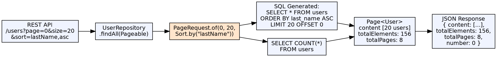

## The Problem

Returning all rows from a large database table in a single query consumes excessive memory, slows response times, and overwhelms clients. Without a standard way to page and sort results, developers must manually write LIMIT/OFFSET SQL and handle page navigation, which is tedious and repetitive.

## Core Idea

Spring Data JPA provides `Pageable` (pagination parameters) and `Sort` (ordering parameters) as standard abstractions for querying subsets of data. Repository methods accept `Pageable` to return `Page<T>` objects containing the requested slice plus total count metadata. Sorting can be combined with pagination or used independently.

## How It Works

1. **Pageable**: Interface with `pageNumber` (0-indexed), `pageSize`, and optional `Sort`
2. **PageRequest**: Concrete implementation: `PageRequest.of(0, 20, Sort.by("lastName"))` — page 1, 20 items, sorted by lastName
3. **Repository acceptance**: `Page<User> findAll(Pageable pageable)` — Spring Data adds LIMIT, OFFSET, and COUNT query
4. **Page<T> response**: `getContent()` (list of entities), `getTotalElements()`, `getTotalPages()`, `getNumber()`, `hasNext()`
5. **Sort**: `Sort.by("lastName").descending().and(Sort.by("firstName"))` — sort by multiple properties
6. **Slice<T>**: Like Page but without total count — more efficient for infinite scroll (no COUNT query)

## Visual Explanation

## Key Properties

- **Pageable**: Standard parameter for pagination — page number, page size, sort
- **Page<T>**: Full result with content + metadata (total elements, total pages, etc.)
- **Slice<T>**: Lightweight result with just content + navigation info (hasNext, hasPrevious)
- **Sort**: Multi-property sorting with direction (ASC/DESC) and null handling
- **Default values**: `@PageableDefault(size=20, sort="id", direction=ASC)` for controller parameters
- **Unpaged**: `Pageable.unpaged()` — return all results without pagination

## Connections

- **Built from:** [[spring-data-jpa|Spring Data JPA]] — Pagination and sorting are built into Spring Data's repository abstraction
- **Built from:** [[jpa-repository|JpaRepository]] — PagingAndSortingRepository provides the findAll(Pageable) method
- **Related:** [[jpa-query-methods|JPA Query Methods]] — Derived query methods can accept Pageable: `findByLastName(String, Pageable)`
- **Related:** [[java-arraylist|Java ArrayList]] — Page's getContent() returns a List, typically backed by ArrayList

## Edge Cases & Gotchas

- **OFFSET performance**: Large offsets (`page=100`, `size=20` → OFFSET 2000) are slow — use keyset pagination for deep pages
- **COUNT query cost**: COUNT(*) on large tables can be expensive — consider Slice (no COUNT) for infinite scroll
- **Sort injection**: `Sort.by("lastName")` — property names are validated, not directly interpolated; but still validate user input for sort fields
- **Sort direction**: Default is ASC; specify `.descending()` for descending
- **0-indexed pages**: `page=0` is the first page — this often confuses frontend developers who expect 1-indexed pages