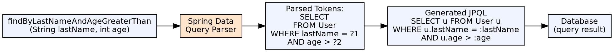

## The Problem

Every data access operation that isn't a basic CRUD operation requires writing a query. Defining, testing, and maintaining dozens of custom queries for every entity creates significant boilerplate and couples repository code to the query implementation.

## Core Idea

Spring Data JPA's derived query methods generate database queries automatically from method names. A method like `findByLastNameAndAgeGreaterThan(String lastName, int age)` is parsed and translated into the corresponding JPQL query at startup, eliminating the need for manual query definitions for standard operations.

## How It Works

1. **Method name parsing**: Spring Data parses `findBy`, `readBy`, `countBy`, `deleteBy` as the action prefix
2. **Property references**: The parser extracts entity property names from the method name (e.g., `LastName`, `Age`)
3. **Criteria keywords**: AND, OR, Between, LessThan, GreaterThan, Like, In, IgnoreCase, OrderBy, Null, NotNull
4. **Nested property traversal**: `findByAddressZipCode(String zip)` traverses the Address→zipCode path
5. **Startup validation**: At application startup, Spring Data validates that all properties in method names actually exist — errors are caught early
6. **@Query override**: If a method name can't express the logic, `@Query("...")` provides explicit JPQL

## Visual Explanation

## Key Properties

- **Supported prefixes**: `findBy`, `readBy`, `getBy`, `queryBy`, `countBy`, `deleteBy`, `removeBy`
- **Criteria keywords**: And, Or, Between, LessThan, GreaterThan, Like, NotLike, In, NotIn, IgnoreCase, OrderBy, True, False, Null, NotNull, Before, After, StartingWith, EndingWith, Containing
- **Limiting results**: `findFirst5By...`, `findTop10By...` — restricts result count
- **Return types**: Entity, `Optional<T>`, `List<T>`, `Stream<T>`, `Page<T>`, `Slice<T>`
- **Validation**: Startup validation catches method names that reference non-existent properties

## Connections

- **Built from:** [[spring-data-jpa|Spring Data JPA]] — Derived query methods are a core feature
- **Built from:** [[jpa-repository|JpaRepository]] — Derived methods are declared on JpaRepository interfaces
- **Related:** [[hql|Hibernate Query Language]] — Both generate JPQL; derived methods are a higher-level abstraction
- **Contrasts with:** [[ejb-ql|EJB Query Language (EJB-QL)]] — EJB-QL is written in deployment descriptors; Spring Data derives queries from method names

## Edge Cases & Gotchas

- **Method name explosion**: `findByLastNameAndAgeGreaterThanAndStatusInOrderByLastNameAsc(...)` — unreadable; use `@Query` for complex cases
- **Distinct**: `findDistinctBy...` for distinct results
- **IgnoreCase**: Works only on String comparisons; added after property: `findByLastNameIgnoreCase`
- **Nested property ambiguity**: `findByAddressZipCode` assumes `address.zipCode` property; if `addressZipCode` is a direct property, it won't find it — disambiguate with `findByAddress_ZipCode`