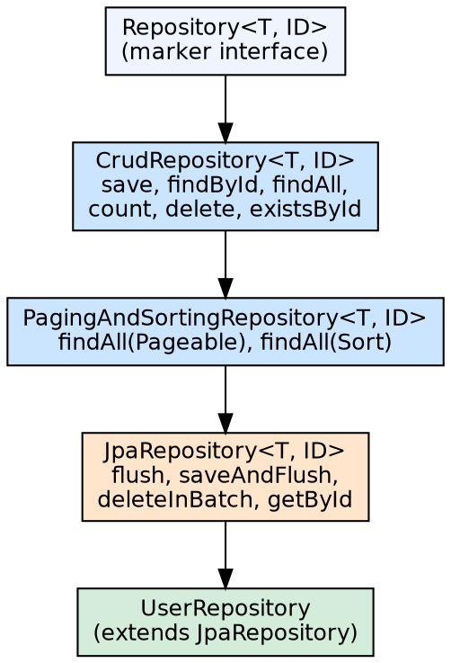

## The Problem

Every data access class needs standard CRUD operations (create, read, update, delete) plus paging and sorting. Writing these methods manually for every entity creates repetitive code that adds no business value and introduces bugs in transaction management, connection handling, and result mapping.

## Core Idea

`JpaRepository<T, ID>` is a Spring Data JPA interface that provides a full set of CRUD, paging, and sorting operations automatically. By extending it, a repository interface inherits `findAll()`, `findById()`, `save()`, `delete()`, `findAll(Pageable)`, and more — no implementation code required. Spring Data generates the implementation at runtime.

## How It Works

1. **Interface hierarchy**: `Repository` (marker) → `CrudRepository` (basic CRUD) → `PagingAndSortingRepository` (pagination) → `JpaRepository` (JPA-specific: flush, batch)
2. **CrudRepository**: `save(S entity)`, `findById(ID id)`, `findAll()`, `count()`, `deleteById(ID id)`, `existsById(ID id)`
3. **PagingAndSortingRepository**: `findAll(Pageable)` → returns `Page<T>` with total count; `findAll(Sort)` → returns sorted `List<T>`
4. **JpaRepository additions**: `findAll()` returns `List<T>` (vs Iterable in CrudRepository), `flush()`, `saveAndFlush()`, `deleteInBatch()`, `getById()`
5. **Runtime proxy**: Spring Data creates a JDK dynamic proxy implementing the interface, using `SimpleJpaRepository` as the default implementation
6. **Custom methods**: Declare `findBy...` methods; Spring Data parses the method name and generates the query

## Visual Explanation

## Key Properties

- **CrudRepository**: Base interface with full CRUD — return types are `Optional<T>` for single result
- **PagingAndSortingRepository**: Adds pagination and sorting support
- **JpaRepository**: Extends both with JPA-specific batch operations and flush control
- **Query by Example**: `findAll(Example.of(probe))` — query by example object
- **Specification**: `JpaSpecificationExecutor` for dynamic criteria queries
- **@NoRepositoryBean**: Marker for intermediate interfaces that shouldn't be instantiated

## Connections

- **Built from:** [[spring-data-jpa|Spring Data JPA]] — JpaRepository is the primary repository interface
- **Built from:** [[hibernate-orm-framework|Hibernate ORM Framework]] — SimpleJpaRepository delegates to EntityManager (Hibernate)
- **Related:** [[jpa-query-methods|JPA Query Methods]] — Derived query methods extend JpaRepository
- **Related:** [[jpa-pagination-sorting|JPA Pagination and Sorting]] — JpaRepository inherits Pageable support
- **Contrasts with:** [[java-jdbc|JDBC]] — JDBC requires manual SQL; JpaRepository is declarative

## Edge Cases & Gotchas

- **save() semantics**: `save()` is both INSERT and UPDATE — Hibernate checks if ID exists; this can cause extra SELECT queries
- **getById() vs findById()**: `getById()` returns a reference (proxy, lazy); `findById()` returns Optional (eager loading)
- **deleteInBatch vs deleteAll**: `deleteInBatch()` uses one JPQL DELETE query; `deleteAll()` loads each entity and calls EntityManager.remove()
- **Transactional behavior**: Repository methods are @Transactional(readOnly=true) for reads, @Transactional for writes