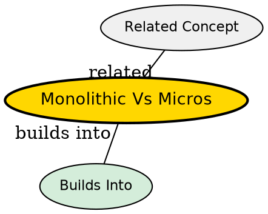

## What's Being Compared

Monolithic architecture builds an application as a single deployable unit, while microservices architecture decomposes it into independently deployable services. The comparison isn't about which is "better" -- it's about which set of tradeoffs matches the application's scale, team structure, and operational maturity.

## The Core Tension

Monoliths optimize for **simplicity** (one codebase, one deploy, one database) at the cost of **scalability** and **team autonomy**. Microservices optimize for **independence** (independent deploy, scale, teams) at the cost of **operational complexity** (distributed systems, network latency, data consistency).

## Comparison

| Dimension | Monolithic | Microservices |
|-----------|-----------|---------------|
| Deployment | Single WAR/JAR | Multiple service JARs |
| Scaling | Scale entire app | Scale per service |
| Team structure | One team per app | One team per service |
| Testing | Single-process E2E | Contract tests, E2E across services |
| Database | Single shared DB | Database per service |
| Inter-service calls | In-process method calls | HTTP/REST or message queue |
| Data consistency | ACID transactions | Eventual consistency / Saga |
| Startup time | Slow (big app) | Fast (small service) |
| Operational needs | Simple (one app to monitor) | Complex (service discovery, tracing) |
| Fault isolation | One bug takes down everything | Failure isolated to one service |

## When to Choose Monolithic

- Small team (1-10 developers)
- Early-stage product (validating market fit)
- Simple domain with clear boundaries
- Limited DevOps/operations resources
- Startup or MVP phase -- get to market fast

## When to Choose Microservices

- Large team (multiple squads)
- Proven product at scale
- Multiple subdomains with clear boundaries
- Mature DevOps practice (CI/CD, monitoring, containers)
- Need to scale different parts independently

## The Insight

The right architecture depends on **team size** and **organizational maturity**, not technology preference. Conway's Law applies: the architecture mirrors the communication structure. Start with a modular monolith (well-organized single deployable); extract microservices only when the monolith's constraints outweigh microservices' complexity. Most successful microservice adoptions started as monoliths.

## Visual Explanation

## Semantic Network

## Connections

- [[java-microservices|Java Microservices]] -- Implementation of microservice architecture in Java
- [[api-gateway-pattern|API Gateway Pattern]] -- Entry point for microservice requests
- [[service-discovery-registry|Service Discovery and Registry]] -- Dynamic service location in microservices
- [[distributed-tracing|Distributed Tracing]] -- Observability across service boundaries
- [[backend-architecture|Backend Architecture]] -- General backend architecture patterns including monolith