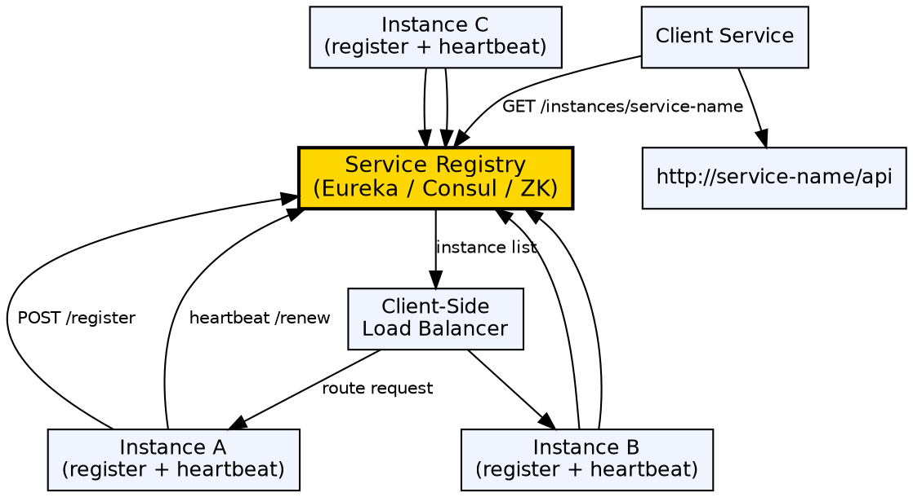

## The Problem

In a dynamic microservices environment, service instances start, stop, scale up, and scale down constantly. Clients can't hard-code IP addresses and ports. Without a discovery mechanism, adding or removing instances requires manual configuration updates, which is error-prone and slow.

## Core Idea

Service Discovery and Registry is a pattern where a central registry (Eureka, Consul, ZooKeeper) maintains the network locations of all available service instances. Services register themselves on startup and send heartbeats to stay registered. Clients query the registry to find available instances by logical service name.

## How It Works

1. **Registration**: Each service instance registers its host, port, health check URL, and metadata with the registry on startup
2. **Heartbeat (renewal)**: Registered instances periodically send heartbeats (e.g., every 30s) to signal they're alive
3. **Eviction**: The registry evicts instances that miss multiple heartbeats (e.g., 3 missed = 90s)
4. **Discovery**: Clients query the registry for a service name → get a list of available instances
5. **Load balancing**: Client-side load balancer selects one instance (round-robin, least connections)
6. **Health checks**: The registry periodically pings service health endpoints to verify they're actually healthy

## Visual Explanation

## Key Properties

- **Service registry**: Central database mapping service names → instance addresses
- **Self-registration**: Services register themselves (vs third-party registration via a separate process)
- **Heartbeat-based health**: Periodic renewal signals liveness; eviction on absence
- **Client-side discovery**: Client queries registry and selects an instance (common in Spring Cloud)
- **Server-side discovery**: Load balancer (Nginx, AWS ALB) queries registry and routes
- **Caching**: Clients cache the registry locally to avoid querying on every request

## Connections

- **Built from:** [[java-microservices|Java Microservices]] — Service discovery is essential for dynamic microservice environments
- **Built from:** [[spring-cloud|Spring Cloud]] — Spring Cloud provides Eureka-based service discovery
- **Related:** [[spring-cloud-service-discovery|Spring Cloud Service Discovery]] — Spring Cloud's implementation with Eureka
- **Related:** [[api-gateway-pattern|API Gateway Pattern]] — API Gateway uses service discovery to route requests
- **Contrasts with:** [[dns|DNS]] — DNS resolves name → single IP (cached, slow to update); registry returns dynamic, health-filtered instance list

## Edge Cases & Gotchas

- **Stale registry entries**: Instances that crash without graceful shutdown (kill -9) leave stale entries — heartbeats eventually evict them
- **Registry SPOF**: The registry itself must be highly available — run in cluster mode
- **Cache staleness**: Client-cached instance lists may point to dead instances — use circuit breakers and retries
- **Bootstrap problem**: Clients need to know registry location before they can discover services — use well-known DNS or static config
- **Multi-datacenter**: Registry should prefer instances in the same datacenter/region (zone affinity) to reduce latency

## Sources

- [[java3-summary|Advanced Java Tutorial — Source Summary]] — Service discovery and registration in microservices
