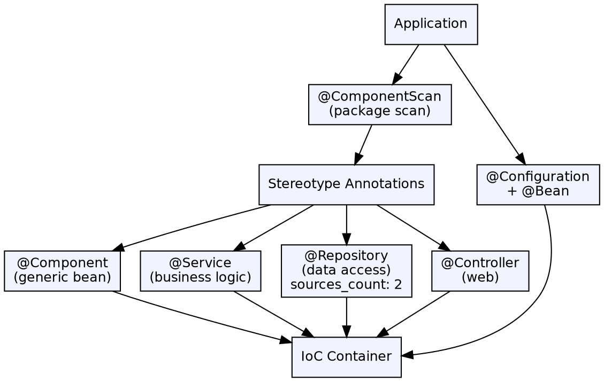

## The Problem

XML-based Spring configuration is verbose. Every bean declaration, property setting, and dependency wiring requires XML elements. As applications grow, XML files become unwieldy and hard to maintain. Developers need a more concise way to declare and configure beans directly in the code that defines them.

## Core Idea

Spring annotations enable declarative bean definition and configuration directly in Java source code. Stereotype annotations (@Component, @Service, @Repository, @Controller) mark classes as Spring-managed beans. Configuration annotations (@Configuration, @Bean, @ComponentScan) replace XML configuration files with Java classes.

## How It Works

1. **Stereotype annotations**: `@Component` (generic), `@Service` (business logic), `@Repository` (data access), `@Controller` (web) — all register the class as a Spring bean
2. **Annotation scanning**: `@ComponentScan` tells Spring to scan specified packages for stereotype-annotated classes
3. **Java configuration**: `@Configuration` classes contain `@Bean` methods that return objects to be managed as beans
4. **Property injection**: `@Value("${property.name}")` injects values from properties files
5. **Bean definition**: `@Bean` in `@Configuration` class defines a bean with full lifecycle control
6. **Conditional beans**: `@Conditional`, `@Profile` create beans only when specific conditions are met

## Visual Explanation

## Key Properties

- **Stereotype hierarchy**: @Service, @Repository, @Controller are specializations of @Component with different semantics
- **Component scanning**: Spring finds annotated classes via classpath scanning — no XML bean declarations needed
- **Java config**: @Configuration + @Bean replaces XML entirely with compile-time-checked config
- **@Scope**: Configures bean scope (singleton, prototype, request, etc.) on the bean class
- **@Lazy**: Defers bean initialization until first use instead of at container startup
- **@Profile**: Activates beans only in specific environments (dev, test, prod)

## Connections

- **Built from:** [[spring-ioc-container|Spring IoC Container]] — Annotations are a configuration method for the container
- **Built from:** [[spring-framework|Spring Framework]] — Annotations modernized Spring configuration
- **Related:** [[spring-autowiring|Spring Autowiring]] — @Autowired works alongside stereotype annotations
- **Builds into:** [[spring-mvc|Spring MVC]] — @Controller, @RequestMapping are Spring MVC annotations
- **Related:** [[spring-boot|Spring Boot]] — @SpringBootApplication combines @Configuration + @ComponentScan + @EnableAutoConfiguration

## Edge Cases & Gotchas

- **Annotation scan scope**: Without @ComponentScan pointing to the right package, @Service and friends do nothing
- **Ambiguous stereotypes**: @Repository adds translation of persistence exceptions; @Service and @Component are functionally identical
- **Proxy mode**: Annotations on methods only work when called through the Spring proxy — internal method calls bypass them
- **Annotation vs XML override**: XML bean definitions can override annotation-based configurations if both are present

## Sources

- [[java3-summary|Advanced Java Tutorial — Source Summary]] — Spring annotations
