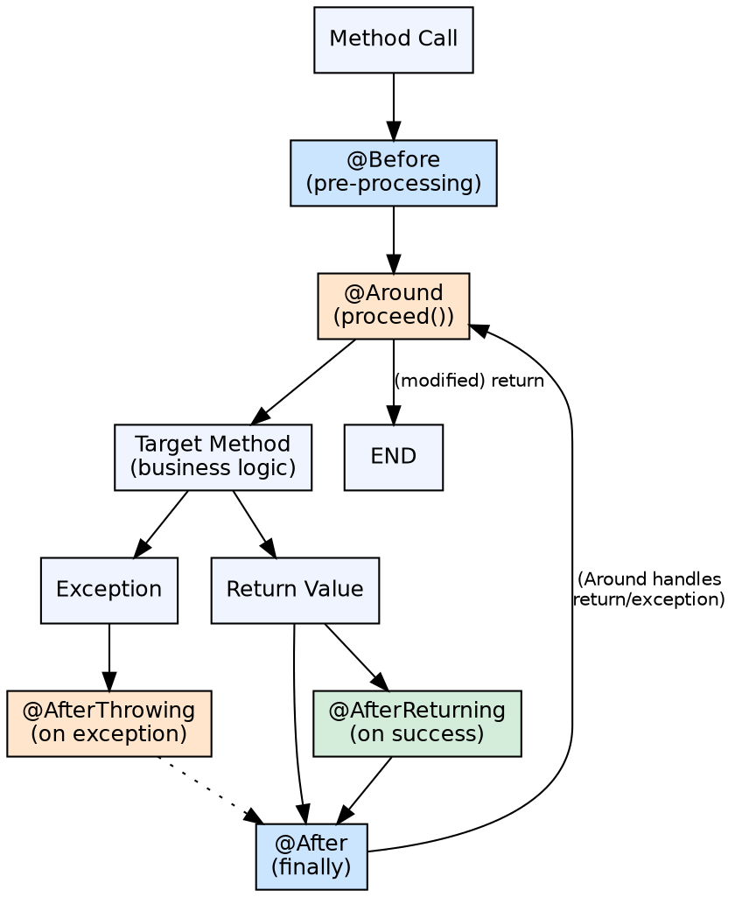

## The Problem

Cross-cutting concerns need fine-grained control over when they execute — before a method runs, after it completes (success or failure), only on success, only on exception, or wrapping the method entirely. Each timing has different use cases and different access to method parameters, return values, and exceptions.

## Core Idea

Spring AOP provides five advice types that define exactly when aspect code executes relative to the target method: `@Before` (pre-processing), `@After` (finally), `@AfterReturning` (post-processing on success), `@AfterThrowing` (error handling), and `@Around` (full control — can skip or modify method execution).

## How It Works

1. **@Before**: Executes before the target method. Can access method arguments via `JoinPoint.getArgs()`. Cannot prevent method execution (unlike Around)
2. **@After**: Executes after the target method completes, regardless of outcome (like finally). Used for cleanup, auditing
3. **@AfterReturning**: Executes after successful return. Can access the return value via `returning` attribute. Not called if method throws
4. **@AfterThrowing**: Executes when the target method throws an exception. Can access the exception via `throwing` attribute
5. **@Around**: Most powerful. Wraps the target method entirely. `ProceedingJoinPoint.proceed()` invokes the target. Can modify arguments, catch exceptions, change return value, skip execution entirely

## Visual Explanation

## Key Properties

- **@Before**: Read method args, perform validation or logging. Cannot abort method
- **@After**: Cleanup, audit logging. Runs like finally block
- **@AfterReturning**: Post-process return value (but can't change it unless using Around). Access via `returning = "result"`
- **@AfterThrowing**: Log or transform exceptions. Access via `throwing = "ex"`
- **@Around**: Most flexible — modify args, catch exceptions, change return value, skip execution entirely
- **JoinPoint**: All advice types (except Around) receive JoinPoint; Around receives ProceedingJoinPoint

## Connections

- **Built from:** [[spring-aop|Spring AOP]] — Advice types are the action component of aspects
- **Built from:** [[spring-framework|Spring Framework]] — AOP advice is a core Spring AOP feature
- **Related:** [[java-try-catch-finally|Try-Catch-Finally]] — Advice types mirror structured exception handling patterns
- **Builds into:** [[declarative-vs-programmatic-transactions|Declarative Transactions]] — @Transactional is implemented via @Around advice
- **Related:** [[spring-security|Spring Security]] — Security annotations use @Before/@Around advice for auth checks

## Edge Cases & Gotchas

- **@Around must call proceed()**: If @Around advice doesn't call `proceed()`, the target method never executes
- **Multiple aspects**: Order is controlled by `@Order` annotation or `Ordered` interface
- **Return value modification**: @AfterReturning can't change the return value (only read it); use @Around to wrap and modify
- **Exception swallowing**: @Around can catch and suppress exceptions — accidentally hiding errors
- **ProceedingJoinPoint**: Only available in @Around advice; casting JoinPoint to ProceedingJoinPoint in other advice types throws ClassCastException

## Sources

- [[java3-summary|Advanced Java Tutorial — Source Summary]] — AOP advice types
