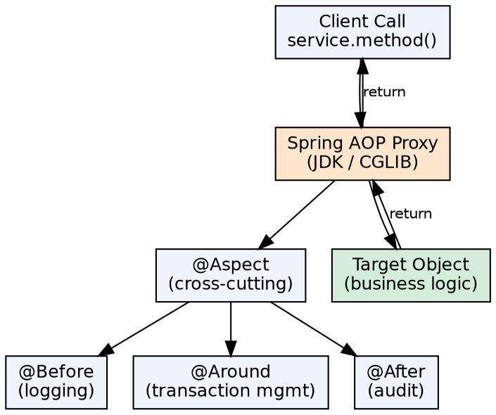

## The Problem

Cross-cutting concerns like logging, transaction management, security checking, and performance monitoring affect many parts of an application. Without AOP, these concerns are scattered across every method (logging everywhere), tangled with business logic, and hard to maintain consistently.

## Core Idea

Aspect-Oriented Programming (AOP) in Spring allows separating cross-cutting concerns from business logic by defining "aspects" that automatically apply behavior at specified "join points." Spring AOP uses proxy-based weaving (JDK dynamic proxies or CGLIB) to intercept method calls and apply aspects without modifying business code.

## How It Works

1. **Aspect**: A modularized cross-cutting concern (e.g., `@Aspect` class with logging logic)
2. **Join point**: A specific point in program execution — in Spring AOP, always a method invocation
3. **Advice**: Action taken at a join point — `@Before` (before method), `@After` (after, regardless of outcome), `@AfterReturning` (after success), `@AfterThrowing` (after exception), `@Around` (wraps the method)
4. **Pointcut**: Expression that selects join points — `execution(* com.example.service.*.*(..))` matches all methods in service package
5. **Weaving**: Spring creates a proxy of the target object and applies aspects at the matched join points
6. **Proxy modes**: JDK dynamic proxy (target implements an interface) or CGLIB proxy (target is a concrete class)

## Visual Explanation

## Key Properties

- **Proxy-based**: Spring AOP is proxy-based, not bytecode weaving — applies only to Spring-managed beans
- **Method-level only**: Only method execution join points; no field access or constructor interception
- **@AspectJ support**: Annotation-based AOP using AspectJ pointcut expression syntax
- **Pointcut designators**: `execution()`, `within()`, `this()`, `target()`, `args()`, `@annotation()`
- **XML config (legacy)**: Spring 1.2 old-style AOP with ProxyFactoryBean and interceptors
- **Auto-proxying**: `@EnableAspectJAutoProxy` automatically creates proxies for `@Aspect` beans

## Connections

- **Built from:** [[spring-framework|Spring Framework]] — AOP is a core Spring module
- **Built from:** [[spring-aop-advice|Spring AOP Advice Types]] — The different advice types implement aspects
- **Builds into:** [[spring-security|Spring Security]] — Security annotations (@PreAuthorize) use Spring AOP
- **Builds into:** [[declarative-vs-programmatic-transactions|Declarative Transactions]] — @Transactional uses Spring AOP
- **Contrasts with:** [[ejb-container|EJB Container]] — EJB uses container-managed interception; Spring AOP is proxy-based

## Edge Cases & Gotchas

- **Internal method calls**: A method within the same class calling another method bypasses the proxy — AOP doesn't apply
- **Final methods**: CGLIB can't override final methods — no AOP for final methods on classes without interfaces
- **Self-injection**: Use `@Autowired MyService self` + `@Lazy` to enable AOP for internal calls
- **Performance**: @Around advice adds overhead to every matched method — use judiciously
- **Proxy exposure**: If the target casts `this` in its methods, it gets the raw object, not the proxy