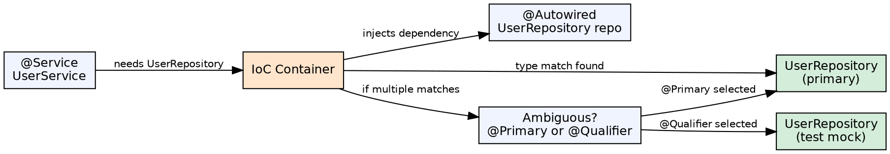

## The Problem

Manually wiring bean dependencies in XML or `@Bean` methods becomes repetitive and error-prone as the number of beans grows. Each dependency requires an explicit `<property>` or `@Bean` method parameter. Developers want the container to resolve dependencies automatically based on type or name.

## Core Idea

Autowiring is Spring's automatic dependency resolution mechanism. The container inspects a bean's constructor, setter, or field and automatically provides the matching dependency. The primary modes are: `byType` (default with `@Autowired`), `byName` (matching bean ID to field name), and explicit `@Qualifier` for disambiguation.

## How It Works

1. **@Autowired field injection**: Container matches field type to a bean of that type in the context
2. **Constructor injection** (preferred): Container resolves constructor parameter types and provides matching beans
3. **Setter injection**: Container calls the setter with the resolved dependency after instantiation
4. **Disambiguation**: If multiple beans of the same type exist, `@Primary` marks the preferred one; `@Qualifier("beanName")` selects by name
5. **Optional dependencies**: `@Autowired(required=false)` — if no bean is found, leaves field as null
6. **@Resource**: JSR-250 annotation, resolves by bean name (field name) first, then by type

## Visual Explanation

## Key Properties

- **Mode byType**: Default behavior — Spring matches by field/constructor parameter type
- **Mode byName**: Matches field name to bean ID (used with `@Resource`)
- **@Primary**: Marks a bean as the preferred choice when multiple candidates exist
- **@Qualifier**: Selects a specific bean by name when type alone is ambiguous
- **Constructor injection preferred**: Immutable dependencies, required by default, better testability
- **Field injection**: Simplest but makes testing harder (no way to set field without reflection)

## Connections

- **Built from:** [[spring-ioc-container|Spring IoC Container]] — Autowiring is the DI resolution mechanism within the container
- **Built from:** [[spring-framework|Spring Framework]] — Autowiring is a core Spring DI feature
- **Related:** [[spring-bean-lifecycle|Spring Bean Lifecycle]] — Autowiring executes during the dependency injection phase
- **Related:** [[spring-annotations|Spring Annotations]] — @Autowired, @Qualifier, @Primary are Spring annotations
- **Contrasts with:** [[ejb-context|EJB Context]] — EJB's JNDI lookup is explicit; Spring autowiring is implicit

## Edge Cases & Gotchas

- **NoUniqueBeanDefinitionException**: Multiple beans of same type without @Primary or @Qualifier — the most common autowiring error
- **Field injection in unit tests**: Need reflection or Spring test runner; constructor injection avoids this entirely
- **Circular dependency with constructor injection**: Unresolvable — use @Lazy on one side or switch to setter injection
- **@Autowired on final fields**: Fails because Spring uses reflection to set fields but final fields can't be set via reflection after construction

## Sources

- [[java3-summary|Advanced Java Tutorial — Source Summary]] — Spring autowiring
