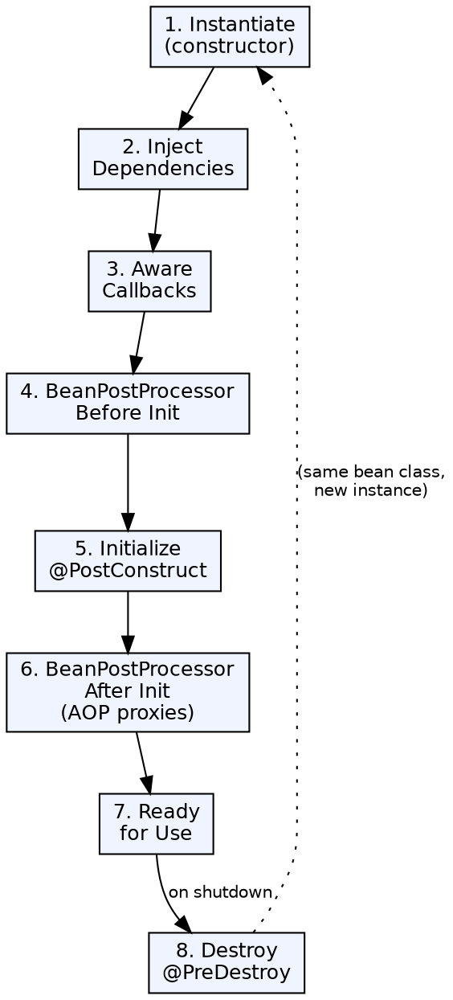

## The Problem

Enterprise applications need fine-grained control over object lifecycle — when objects are created, how they're initialized, what happens after all dependencies are set, and how they're cleaned up. Different use cases require different sharing strategies (singleton for stateless services, prototype for stateful objects).

## Core Idea

The Spring Bean Lifecycle defines the birth-to-death phases every managed bean goes through: instantiation → dependency injection → initialization → ready → destruction. Bean scopes determine how long a bean lives and how many instances are created. Custom scopes can be defined for special use cases.

## How It Works

1. **Instantiation**: Container creates the bean instance via constructor
2. **Dependency injection**: Container injects dependencies (via constructor, setter, or field)
3. **Awareness callbacks**: If bean implements `BeanNameAware`, `BeanFactoryAware`, `ApplicationContextAware`, container calls them
4. **Pre-initialization**: `BeanPostProcessor.postProcessBeforeInitialization()` — container-wide hooks
5. **Initialization**: `@PostConstruct` method → `InitializingBean.afterPropertiesSet()` → custom `init-method`
6. **Post-initialization**: `BeanPostProcessor.postProcessAfterInitialization()` — proxy creation happens here (AOP)
7. **Ready**: Bean is fully initialized and available for use
8. **Destruction**: `@PreDestroy` method → `DisposableBean.destroy()` → custom `destroy-method`
9. **Scopes**: singleton (one per container), prototype (new per request), request/ session/application (web contexts), custom

## Visual Explanation

## Key Properties

- **Singleton scope**: Default; one instance per IoC container; ideal for stateless services
- **Prototype scope**: New instance every time the bean is requested; use for stateful objects
- **Web scopes**: request (one per HTTP request), session (one per HTTP session), application (one per ServletContext)
- **Custom scopes**: Define custom scope logic (e.g., thread-scoped, tenant-scoped) via `Scope` interface
- **BeanPostProcessor**: Container-wide hooks that run for every bean — critical for AOP proxy creation
- **Lifecycle callbacks**: Three ways per phase: annotations (@PostConstruct/@PreDestroy), interfaces, custom init/destroy method

## Connections

- **Built from:** [[spring-ioc-container|Spring IoC Container]] — The container manages the entire bean lifecycle
- **Built from:** [[spring-framework|Spring Framework]] — Lifecycle management is a core Spring feature
- **Related:** [[spring-autowiring|Spring Autowiring]] — Dependency injection occurs during the lifecycle's second phase
- **Related:** [[ejb-lifecycle-stateless|Stateless Bean Lifecycle]] — EJB containers also manage bean lifecycles, but with different phases
- **Contrasts with:** [[ejb-lifecycle-stateful|Stateful Bean Lifecycle]] — EJB stateful beans have passivation/activation; Spring beans don't

## Edge Cases & Gotchas

- **Prototype destruction**: Container does NOT call destroy() on prototype beans — you must clean them up manually
- **Circular dependency**: Constructor injection + circular dependency causes BeanCurrentlyInCreationException; use setter injection or @Lazy
- **PostConstruct in proxy**: `@PostConstruct` in a proxy-wrapped bean runs on the target, not the proxy
- **Scope mismatch**: Injecting a shorter-lived bean (request) into a longer-lived bean (singleton) requires scoped proxy (`@Scope(proxyMode=ScopedProxyMode.TARGET_CLASS)`)

## Sources

- [[java3-summary|Advanced Java Tutorial — Source Summary]] — Bean lifecycle, custom bean scopes
