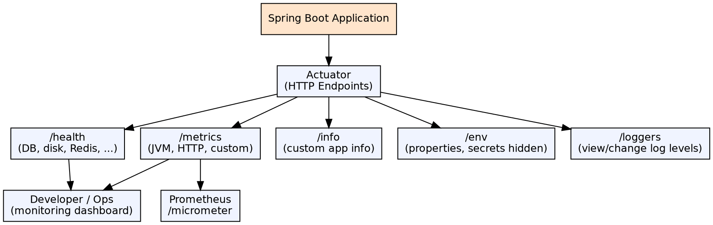

## The Problem

Production applications need runtime visibility: Are they healthy? How much memory are they using? What's the request rate? Are there active database connections? Without built-in monitoring, developers resort to SSH access, custom scripts, or third-party agents — which are inconsistent and fragile.

## Core Idea

Spring Boot Actuator provides production-ready HTTP endpoints for monitoring and managing Spring Boot applications. Endpoints expose health information, metrics, environment properties, thread dumps, and more. It integrates with Micrometer for exporting metrics to monitoring systems (Prometheus, Graphite, Datadog).

## How It Works

1. **Actuator endpoints**: `/actuator/health` (app health), `/actuator/metrics` (JVM and app metrics), `/actuator/info` (custom app info), `/actuator/env` (environment properties), `/actuator/loggers` (log level management)
2. **Health indicators**: Built-in indicators check database connectivity, disk space, Redis, Elasticsearch, etc. — all aggregated into the `/health` response
3. **Micrometer**: Actuator's metrics facade sends metrics to various monitoring systems (Prometheus, Graphite, InfluxDB)
4. **Security**: Actuator endpoints are secured by default (Spring Security integration); sensitive endpoints restricted to authenticated users
5. **Custom endpoints**: `@Endpoint` annotation to create custom actuator endpoints with `@ReadOperation`, `@WriteOperation`, `@DeleteOperation`

## Visual Explanation

## Key Properties

- **Built-in endpoints**: 15+ production endpoints (health, metrics, env, loggers, heapdump, threaddump, mappings)
- **Health aggregation**: Downstream service health indicators aggregated into overall UP/DOWN status
- **Micrometer integration**: Vendor-neutral metrics facade; binders for JVM, CPU, file descriptors, logback, HikariCP
- **Audit events**: `AuditEventRepository` captures authentication and other security events
- **Custom info**: `/info` endpoint exposes any properties under `info.*` in application.properties
- **Log level management**: Change log levels at runtime via POST to `/actuator/loggers/{name}` — no restart needed

## Connections

- **Built from:** [[spring-boot|Spring Boot]] — Actuator is a Spring Boot module for production monitoring
- **Related:** [[spring-boot-auto-configuration|Spring Boot Auto-Configuration]] — Actuator auto-configures endpoints based on available dependencies
- **Related:** [[spring-boot-rest-api|Spring Boot REST API]] — Actuator endpoints are themselves REST APIs
- **Contrasts with:** [[ejb-context|EJB Context]] — EJB provides programmatic context; Boot Actuator provides HTTP-accessible monitoring

## Edge Cases & Gotchas

- **Sensitive info in /env**: Environment values containing passwords/keys are sanitized by default; configure additional sanitization keys
- **Endpoint exposure**: By default, only `/health` and `/info` are exposed via HTTP — use `management.endpoints.web.exposure.include=*` to expose all
- **Security**: Exposing `/actuator/shutdown` without authentication allows anyone to stop the application
- **Performance impact**: High-frequency metrics collection (every 1ms) can impact performance; use appropriate export intervals
- **Health cascading**: If a downstream service is DOWN, the application reports DOWN — configure health indicator thresholds

## Sources

- [[java3-summary|Advanced Java Tutorial — Source Summary]] — Spring Boot Actuator
