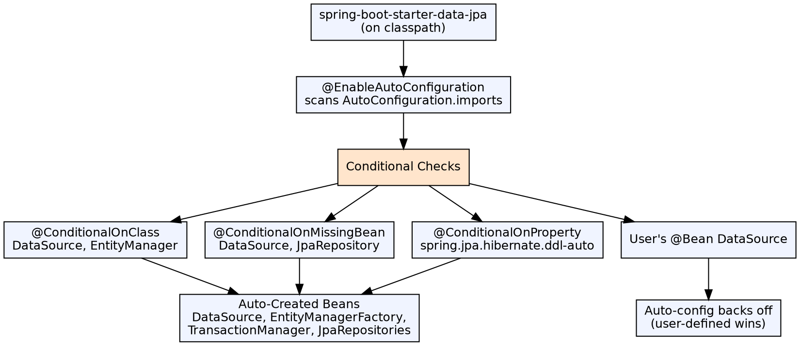

## The Problem

Spring applications need many infrastructure beans: DataSource, EntityManagerFactory, TransactionManager, DispatcherServlet, ViewResolver, MessageConverter. Manually configuring all of them is repetitive, error-prone, and project-specific — the same patterns repeat across every Spring project.

## Core Idea

Auto-configuration is Spring Boot's mechanism for automatically creating and configuring beans based on dependencies on the classpath. It uses `@Conditional` annotations to apply configuration only when specific classes, beans, or properties are present. Starters are curated dependency descriptors that trigger auto-configuration for a specific technology.

## How It Works

1. **@EnableAutoConfiguration**: Triggers scanning of `META-INF/spring/org.springframework.boot.autoconfigure.AutoConfiguration.imports`
2. **Conditional evaluation**: Each auto-configuration class has `@ConditionalOnClass`, `@ConditionalOnMissingBean`, `@ConditionalOnProperty` conditions
3. **Example**: If `DataSource` class is on classpath AND no `DataSource` bean is defined, Boot auto-creates one from `application.properties`
4. **@ConditionalOnClass**: Configuration applies only if specific classes exist on classpath (e.g., `HSQL Driver`)
5. **@ConditionalOnMissingBean**: Don't override user-defined beans — user's `@Bean` takes priority
6. **@ConditionalOnProperty**: Enable/disable configuration via properties (e.g., `spring.jpa.hibernate.ddl-auto`)
7. **Override mechanism**: User defines a `@Bean` of the same type → auto-configuration backs off

## Visual Explanation

## Key Properties

- **Conditional annotations**: `@ConditionalOnClass`, `@ConditionalOnMissingBean`, `@ConditionalOnProperty`, `@ConditionalOnResource`, etc.
- **Starter dependencies**: `spring-boot-starter-web`, `spring-boot-starter-data-jpa`, `spring-boot-starter-security` — each pulls the transitive deps needed
- **Auto-configuration report**: Enable `--debug` to see which auto-configurations applied and which were skipped
- **Custom starter**: Create `spring-boot-starter-*` with auto-configuration module + starter POM
- **Property binding**: `@ConfigurationProperties` binds properties to structured Java objects

## Connections

- **Built from:** [[spring-boot|Spring Boot]] — Auto-configuration is the core feature of Spring Boot
- **Related:** [[spring-boot-actuator|Spring Boot Actuator]] — Actuator's auto-configuration adds health, metrics endpoints
- **Related:** [[spring-boot-rest-api|Spring Boot REST API]] — Web auto-configuration sets up embedded Tomcat + Jackson + MVC
- **Contrasts with:** [[ejb-deployment-descriptor|EJB Deployment Descriptor]] — EJB uses declarative XML; Spring Boot uses classpath-based conditions
- **Builds into:** [[spring-data-jpa|Spring Data JPA]] — Spring Boot auto-configures DataSource and JPA repos

## Edge Cases & Gotchas

- **Hidden configuration**: Auto-configuration can create beans you didn't expect — use `spring-boot:run --debug` to see the report
- **Override confusion**: Simply adding your own `@Bean` of the same type disables auto-configuration — sometimes intentionally
- **Starter conflicts**: Conflicting starters (e.g., two embedded DBs on classpath) can cause startup failures
- **Exclusion**: Exclude auto-configuration classes with `@SpringBootApplication(exclude = DataSourceAutoConfiguration.class)`
- **Performance**: Auto-configuration evaluation happens at startup — hundreds of conditional checks can slow cold starts