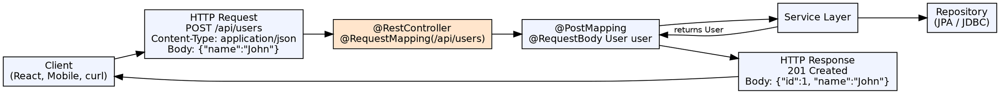

## The Problem

Modern applications expose APIs for frontend clients, mobile apps, and third-party integrations. Building RESTful APIs requires mapping HTTP methods to operations, serializing/deserializing JSON, handling status codes, and managing request/response formats. Without good tooling, this involves significant boilerplate.

## Core Idea

Spring Boot makes REST API development effortless by combining `@RestController` for request handling, auto-configured Jackson for JSON serialization, embedded Tomcat for serving, and Actuator for monitoring. A single `@SpringBootApplication` class and a few controller methods produce a production-ready REST API.

## How It Works

1. **@RestController**: `@Controller` + `@ResponseBody` — every method returns data (JSON/XML), not view names
2. **Request mapping**: `@GetMapping`, `@PostMapping`, `@PutMapping`, `@DeleteMapping` map HTTP verbs and URLs
3. **Request binding**: `@PathVariable`, `@RequestParam`, `@RequestBody` bind request data to method parameters
4. **Response serialization**: Jackson (auto-configured) serializes Java objects to JSON; `@JsonIgnore`, `@JsonProperty` control output
5. **Status codes**: `@ResponseStatus(HttpStatus.CREATED)` or `ResponseEntity` for full control
6. **Exception handling**: `@RestControllerAdvice` provides consistent JSON error responses across all endpoints
7. **Documentation**: Spring Boot integrates with Swagger/OpenAPI for auto-generated API docs

## Visual Explanation

## Key Properties

- **RESTful mapping**: One annotation per HTTP verb — `@GetMapping`, `@PostMapping`, `@PutMapping`, `@DeleteMapping`, `@PatchMapping`
- **Content negotiation**: Jackson serializes to JSON by default; XML if Jackson XML extension is on classpath
- **ResponseEntity**: Full control over status, headers, and body — `ResponseEntity.created(location).body(savedUser)`
- **Request validation**: `@Valid` + BindingResult for request body validation
- **HATEOAS**: Spring HATEOAS adds link support for hypermedia-driven APIs
- **Testing**: `MockMvc` and `WebTestClient` for comprehensive REST API testing

## Connections

- **Built from:** [[spring-boot|Spring Boot]] — Boot auto-configures the web stack for REST APIs
- **Built from:** [[spring-controller|Spring Controller]] — @RestController is a specialized @Controller
- **Related:** [[jax-rpc|JAX-RPC]] — JAX-RPC is XML-based SOAP; Spring Boot REST is JSON-based, lighter
- **Builds into:** [[java-microservices|Java Microservices]] — REST APIs are the communication backbone of microservices
- **Related:** [[http-protocol|HTTP Protocol]] — REST APIs use HTTP semantics (methods, status codes, headers)

## Edge Cases & Gotchas

- **Circular references**: Bidirectional JPA relationships cause infinite JSON serialization — use `@JsonIgnore` or `@JsonManagedReference`/`@JsonBackReference`
- **Global prefix**: All APIs under `/api/v1/` — set `server.servlet.context-path` or use `RequestMapping` at class level
- **Content-type mismatch**: Client sends wrong Content-Type → 415 Unsupported Media Type
- **Versioning**: URL path versioning (`/v1/users`) vs header versioning (`Accept: application/vnd.company.v1+json`)
- **CORS**: Browsers block cross-origin requests; `@CrossOrigin` or `WebMvcConfigurer.addCorsMappings()` to allow