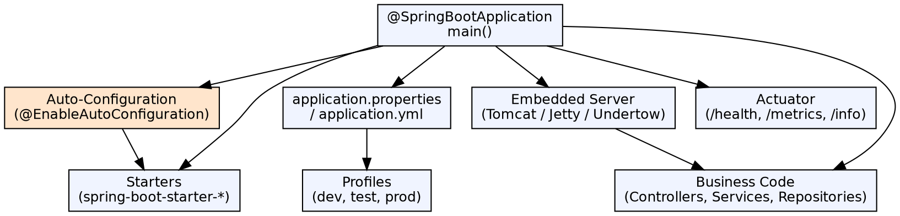

## The Problem

Setting up a Spring application requires extensive configuration: choosing a servlet container, configuring DispatcherServlet, setting up view resolvers, managing dependency versions, writing XML/Java config — all before writing any business code. This setup overhead delays development and varies across projects.

## Core Idea

Spring Boot is an opinionated framework on top of Spring that eliminates boilerplate configuration through auto-configuration and starter dependencies. It embeds Tomcat/Jetty/Undertow, provides sensible defaults for all Spring modules, and enables production-ready features (metrics, health checks) with minimal effort.

## How It Works

1. **@SpringBootApplication**: Combines @Configuration, @ComponentScan, @EnableAutoConfiguration
2. **Auto-configuration**: Spring Boot detects libraries on the classpath and automatically configures beans — e.g., if H2 is on classpath, auto-configures a DataSource
3. **Starters**: Curated dependency descriptors (`spring-boot-starter-web` includes Spring MVC + embedded Tomcat + Jackson)
4. **Embedded server**: Application runs as a standalone JAR with embedded Tomcat — no WAR deployment needed
5. **Externalized configuration**: application.properties or application.yml with environment-specific profiles
6. **Actuator**: Production endpoints for health, metrics, environment, loggers, thread dumps

## Visual Explanation

## Key Properties

- **Opinionated defaults**: Sensible configurations chosen automatically based on classpath contents
- **Standalone JAR**: Run with `java -jar app.jar` — no external web server needed
- **Starters**: ~50 curated dependency sets; one-liner in build file replaces pages of dependency management
- **Actuator**: Built-in production monitoring: health, metrics, environment, loggers
- **Externalized config**: Properties, YAML, environment variables, command-line arguments — with precedence order
- **Spring Boot CLI**: Groovy-based command-line tool for rapid prototyping (optional)

## Connections

- **Built from:** [[spring-framework|Spring Framework]] — Spring Boot builds on and auto-configures Spring Framework
- **Built from:** [[spring-boot-auto-configuration|Spring Boot Auto-Configuration]] — The auto-configuration mechanism drives Spring Boot
- **Builds into:** [[spring-boot-actuator|Spring Boot Actuator]] — Actuator provides production monitoring
- **Builds into:** [[spring-boot-rest-api|Spring Boot REST API]] — REST APIs are a primary use case for Spring Boot
- **Related:** [[spring-mvc|Spring MVC]] — Spring Boot auto-configures Spring MVC with embedded server
- **Contrasts with:** [[ejb-jar-file|EJB-JAR File]] — EJB requires an application server; Spring Boot is self-contained

## Edge Cases & Gotchas

- **Auto-configuration ignorance**: Auto-configuration applies conditionally — if you define your own bean, Boot's default backs off
- **Fat JAR size**: Spring Boot executable JARs include all dependencies — can be 20MB+; use Docker layers for efficient deployment
- **DevTools**: `spring-boot-devtools` enables live reload but should NEVER be included in production builds
- **Context path**: By default, server runs on root context; set `server.servlet.context-path=/myapp` in properties
- **Profile-specific config**: `application-dev.properties` overrides `application.properties` when `spring.profiles.active=dev`

## Sources

- [[java3-summary|Advanced Java Tutorial — Source Summary]] — Spring Boot overview, architecture, configuration
