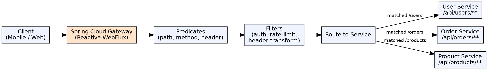

## The Problem

In a microservices architecture, clients would need to know the location of every service, handle authentication for each service, and manage cross-cutting concerns (rate limiting, logging) individually. This creates tight coupling between clients and services, and duplicates security/observability logic.

## Core Idea

Spring Cloud Gateway is an API Gateway built on Spring WebFlux (Reactive). It acts as a single entry point for all client requests, routing them to the appropriate microservice based on path, headers, or other predicates. It handles cross-cutting concerns — authentication, rate limiting, header transformation — in one place.

## How It Works

1. **Route definition**: Routes match incoming requests using predicates (path, method, header, query param)
2. **Predicate matching**: `Path=/users/**` matches all requests starting with `/users`
3. **Filter chains**: Before routing to the service, the request passes through a filter chain: authentication, rate limiting, header modification
4. **Service routing**: Gateway forwards the request to the target service (discovered via Eureka or configured URI)
5. **Response filters**: On the return path, filters modify the response (add headers, transform body)
6. **WebFlux**: Built on reactive Netty, not Tomcat — non-blocking I/O for high throughput

## Visual Explanation

## Key Properties

- **Reactive**: Built on Spring WebFlux, not Servlet API — non-blocking, high concurrency
- **Route predicates**: Path, Method, Header, Query, Cookie, Host, RemoteAddr, Weight
- **Filters**: AddRequestHeader, AddResponseHeader, CircuitBreaker, Retry, RateLimiter, RequestRateLimiter
- **Service discovery integration**: Automatically resolves service names via Eureka / LoadBalancer
- **Custom filters**: Implement `GatewayFilter` or `GlobalFilter` interfaces for custom logic
- **Circuit breaking**: Integrates with Resilience4j for downstream service failure protection

## Connections

- **Built from:** [[spring-cloud|Spring Cloud]] — Gateway is a Spring Cloud module for edge services
- **Built from:** [[spring-cloud-service-discovery|Spring Cloud Service Discovery]] — Gateway uses Eureka to find service instances
- **Related:** [[spring-boot|Spring Boot]] — Gateway is auto-configured via Spring Boot
- **Builds into:** [[java-microservices|Java Microservices]] — API Gateway is a core component of microservice architecture
- **Contrasts with:** [[servlets|Servlets]] — Servlets are blocking I/O; Gateway uses reactive non-blocking WebFlux

## Edge Cases & Gotchas

- **WebFlux vs MVC**: Gateway runs on Netty (WebFlux) — can't use `@Controller`, `RestTemplate`; use `WebClient` instead
- **WebSocket support**: Gateway supports WebSocket proxying via `ws:` / `wss:` route URIs
- **CORS**: Gateway must handle CORS at the edge — configure `spring.cloud.gateway.globalcors`
- **Latency**: Each filter adds latency — keep filter chains lean
- **Gateway as SPOF**: The gateway is a single point of entry — deploy multiple instances behind a load balancer

## Sources

- [[java3-summary|Advanced Java Tutorial — Source Summary]] — API Gateway with Spring Cloud
