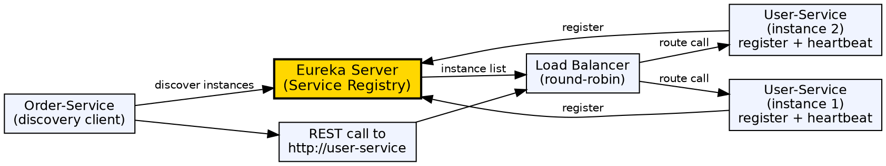

## The Problem

In a microservices architecture, service instances come and go dynamically — scaled up, down, or failed. Hard-coding service URLs (e.g., `http://192.168.1.5:8080`) makes the system brittle. Services need a dynamic registry to discover each other's locations without manual configuration.

## Core Idea

Spring Cloud Service Discovery uses a service registry (Netflix Eureka) where each microservice registers its network location on startup and periodically sends heartbeats. Clients query the registry by logical service name (e.g., `user-service`) to get available instances and distribute requests using client-side load balancing.

## How It Works

1. **Eureka Server**: A standalone service that maintains a registry of all available service instances. Services register their host, port, health status
2. **Service registration**: Each microservice, annotated with `@EnableEurekaClient`, registers with the Eureka server on startup
3. **Heartbeat (renew)**: Registered services send periodic heartbeats (default 30s) to signal they're alive. Missed heartbeats → instance is evicted
4. **Service discovery**: Clients use `@LoadBalanced RestTemplate` or Spring Cloud OpenFeign to call services by logical name — e.g., `http://user-service/api/users`
5. **Load balancing**: Spring Cloud LoadBalancer intercepts the logical name, queries Eureka for instances, and selects one (round-robin, random, etc.)
6. **Client-side vs Server-side**: Client-side (Ribbon/LoadBalancer) — client chooses instance; Server-side — load balancer (Nginx, AWS ELB) distributes requests

## Visual Explanation

## Key Properties

- **Eureka Server**: Central registry; each service registers its metadata (host, port, health URL)
- **@EnableEurekaClient**: Annotation to make a Spring Boot service a Eureka client
- **Heartbeat mechanism**: Periodic renewal (30s); eviction after missed heartbeats (90s default)
- **Client-side load balancing**: Spring Cloud LoadBalancer selects instance; supports round-robin, weighted, custom strategies
- **Self-preservation mode**: Eureka stops evicting instances during network partition — favors availability over consistency
- **OpenFeign**: Declarative HTTP client — `@FeignClient("user-service")` interface with `@GetMapping("/api/users")`

## Connections

- **Built from:** [[spring-cloud|Spring Cloud]] — Service discovery is a core Spring Cloud feature
- **Built from:** [[spring-boot|Spring Boot]] — Eureka client auto-configuration via Spring Boot
- **Related:** [[spring-cloud-api-gateway|Spring Cloud API Gateway]] — Gateway routes requests using service discovery
- **Builds into:** [[java-microservices|Java Microservices]] — Service discovery is essential for microservice communication
- **Contrasts with:** [[dns|DNS]] — DNS resolves hostname → IP; service discovery resolves service name → dynamic IP list

## Edge Cases & Gotchas

- **Eureka AP vs CP**: Eureka favors Availability over Consistency (AP in CAP theorem) — during network partitions, stale instances remain
- **Slow startup**: First call after startup may fail because the client's registry is not yet populated — use retries
- **Zone affinity**: Eureka supports zones for regional deployment — clients prefer instances in the same zone
- **Default port**: Eureka server runs on port 8761 by default — change via `server.port` in configuration
- **Stale cache**: Client caches the registry — use appropriate refresh intervals or manual eviction in failure scenarios