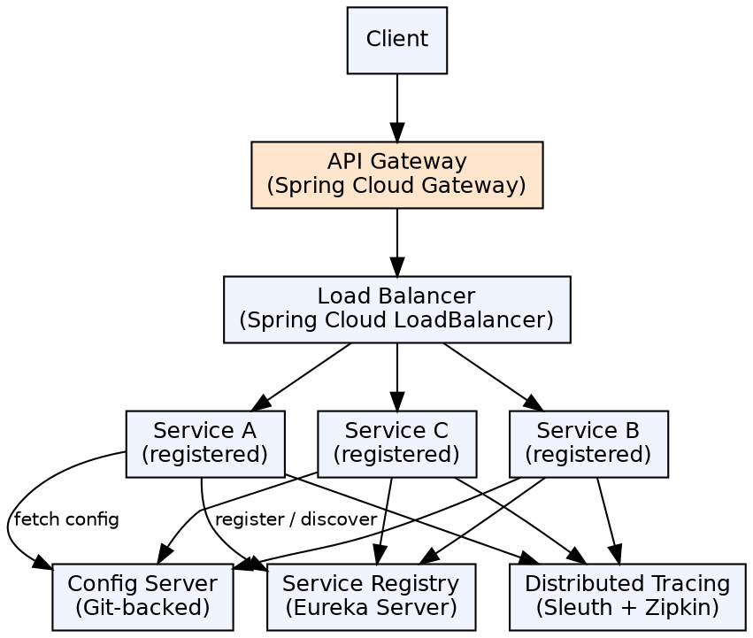

## The Problem

Building cloud-native microservices requires solving distributed system challenges: service discovery (how do services find each other?), load balancing (which instance to call?), distributed configuration (how to manage config across services?), and fault tolerance (what happens when a service is down?).

## Core Idea

Spring Cloud provides a suite of tools for building cloud-native microservices. It integrates with Netflix OSS (Eureka for service discovery, Ribbon for load balancing, Hystrix for circuit breaking), provides distributed configuration with Spring Cloud Config, API gateway with Spring Cloud Gateway, and distributed tracing with Sleuth/Zipkin.

## How It Works

1. **Service discovery**: Spring Cloud Netflix Eureka — services register with Eureka server, clients discover via service name
2. **Load balancing**: Spring Cloud LoadBalancer (replaced Netflix Ribbon) — client-side load balancing across service instances
3. **API Gateway**: Spring Cloud Gateway — routes requests to appropriate services, handles cross-cutting (auth, rate limiting)
4. **Distributed config**: Spring Cloud Config Server — external configuration stored in Git, served to all services
5. **Distributed tracing**: Spring Cloud Sleuth + Zipkin — trace IDs propagate across service calls, visualized in Zipkin dashboard
6. **Fault tolerance**: Resilience4j (replaced Hystrix) — circuit breakers, retries, bulkheads, rate limiters

## Visual Explanation

## Key Properties

- **Service discovery**: Eureka server for service registration and discovery; Spring Cloud LoadBalancer for client-side load balancing
- **API Gateway**: Route requests, add headers, rate-limiting, authentication, circuit breaking at edge
- **Configuration management**: Externalized, version-controlled configuration via Spring Cloud Config (Git backend)
- **Circuit breakers**: Resilience4j for fault tolerance — prevents cascading failures
- **Distributed tracing**: Sleuth adds trace/span IDs; Zipkin visualizes request flows across services
- **Cloud platform support**: AWS (EC2, S3, SQS), GCP, Azure integrations via Spring Cloud for each provider

## Connections

- **Built from:** [[spring-boot|Spring Boot]] — Spring Cloud builds on Spring Boot's auto-configuration
- **Built from:** [[spring-framework|Spring Framework]] — Spring Cloud uses Spring's DI and configuration
- **Related:** [[spring-cloud-service-discovery|Spring Cloud Service Discovery]] — Eureka and LoadBalancer enable service-to-service calls
- **Related:** [[spring-cloud-api-gateway|Spring Cloud API Gateway]] — Gateway is the entry point for all microservices
- **Builds into:** [[java-microservices|Java Microservices]] — Spring Cloud provides the infrastructure for microservices
- **Contrasts with:** [[j2ee-specification|J2EE Specification]] — J2EE is monolithic; Spring Cloud is cloud-native microservices

## Edge Cases & Gotchas

- **Eureka self-preservation**: In network partitions, Eureka keeps its registrations (AP over CP) — stale entries during real failures
- **Config server SPOF**: Config server is a single point of failure — make it highly available or use native cloud config services
- **Gateway latency**: Every request goes through the gateway, adding latency — avoid putting heavy logic in gateway filters
- **Bootstrap context**: Spring Cloud uses `bootstrap.yml` (loaded before application.yml) for config server location — easy to misconfigure
- **Version compatibility**: Spring Cloud releases are coordinated (2020.0.x, 2021.0.x, etc.) — Spring Boot version must match the cloud release train