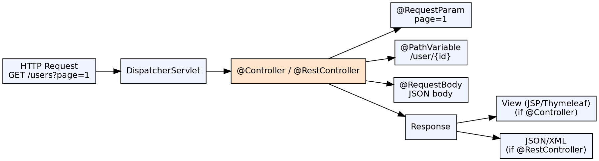

## The Problem

Web application logic needs to respond to specific URL patterns, extract parameters from requests, and return data or views to the client. Without a structured approach, each page would manually parse URLs, manage HTTP methods, and construct responses — duplicating effort across handlers.

## Core Idea

Spring Controllers are `@Controller`-annotated classes whose methods handle specific URL patterns and HTTP methods, defined via `@RequestMapping` and its shortcut annotations (`@GetMapping`, `@PostMapping`, etc.). `@RestController` combines `@Controller` with `@ResponseBody` for REST APIs, automatically serializing return values to JSON or XML.

## How It Works

1. **@RequestMapping**: Maps HTTP method + URL path to a controller method — e.g., `@GetMapping("/users/{id}")`
2. **Method parameters**: Automatically bound from request: `@RequestParam` (query params), `@PathVariable` (URL segments), `@RequestBody` (JSON body), `@ModelAttribute` (form data)
3. **Return types**: String (view name), ModelAndView, `@ResponseBody` (JSON/XML), ResponseEntity (full control)
4. **@RestController**: All methods default to `@ResponseBody`; no view resolution — returns data directly
5. **@Controller vs @RestController**: @Controller returns view names; @RestController returns data (JSON/XML)

## Visual Explanation

## Key Properties

- **@RequestMapping shortcuts**: `@GetMapping`, `@PostMapping`, `@PutMapping`, `@DeleteMapping`, `@PatchMapping`
- **@PathVariable**: Binds URL template variables — `@GetMapping("/users/{id}")` + `(@PathVariable Long id)`
- **@RequestParam**: Binds query parameters with optional default values and required flag
- **@RequestBody**: Deserializes request body (JSON/XML) to Java object using HttpMessageConverter
- **@ResponseBody**: Serializes return value directly to HTTP response body
- **@ResponseStatus**: Sets HTTP status code on successful method execution

## Connections

- **Built from:** [[spring-mvc|Spring MVC]] — Controllers are the handler components in Spring MVC
- **Built from:** [[dispatcher-servlet|DispatcherServlet]] — DispatcherServlet invokes controller methods
- **Related:** [[spring-form-handling|Spring Form Handling]] — @ModelAttribute binds form data to model objects
- **Related:** [[spring-mvc-exception-handling|Spring MVC Exception Handling]] — @ExceptionHandler in controllers
- **Contrasts with:** [[servlets|Servlets]] — Servlets extend HttpServlet; Spring Controllers are POJOs with annotations

## Edge Cases & Gotchas

- **@RequestParam required=true by default**: Missing required param returns 400 — use `required=false` or `defaultValue`
- **@PathVariable vs @RequestParam**: Path variables identify resources; request params filter/ paginate
- **@ResponseBody + String**: Returns the string itself, not a view name — common confusion with @Controller
- **Method-level vs class-level @RequestMapping**: Class-level is the prefix; method-level defines the specific endpoint

## Sources

- [[java3-summary|Advanced Java Tutorial — Source Summary]] — Spring Controller, @RequestMapping, @RequestParam, @RestController
