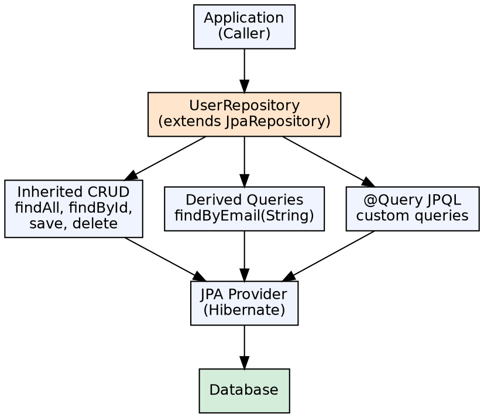

## The Problem

Implementing data access layers requires writing repetitive DAO (Data Access Object) code: creating queries, managing EntityManager, handling transactions, mapping results. Even with Hibernate, developers still write CRUD methods for every entity — findAll, findById, save, delete, plus custom query methods.

## Core Idea

Spring Data JPA is a data access framework that eliminates boilerplate repository code. By extending `JpaRepository` (or `CrudRepository`), interfaces automatically inherit CRUD methods without implementation. Custom queries are derived from method names (e.g., `findByLastName(String name)`) or defined via `@Query`.

## How It Works

1. **Repository interface**: `public interface UserRepository extends JpaRepository<User, Long>` — no implementation needed
2. **Inherited methods**: `findAll()`, `findById()`, `save()`, `delete()`, `count()`, `existsById()` — all auto-implemented
3. **Derived query methods**: Method names like `findByEmailAndActive(String email, boolean active)` — Spring Data parses the name and generates JPQL
4. **@Query**: Custom JPQL or native SQL queries for complex operations: `@Query("SELECT u FROM User u WHERE u.email = :email")`
5. **Pagination**: `Pageable` parameter returns `Page<T>` with total count, sorting, and pagination metadata
6. **Sorting**: `Sort.by("lastName").ascending()` or `findAll(Sort.by("lastName"))`

## Visual Explanation

## Key Properties

- **Interface-based**: No implementation to write — Spring Data generates the proxy at runtime
- **Derived queries**: Parse method naming conventions: `findBy`, `readBy`, `countBy`, `deleteBy`
- **Query methods**: Support AND, OR, Between, LessThan, GreaterThan, Like, In, IgnoreCase, OrderBy
- **Pagination**: `Pageable` parameter → `Page<T>` result with total elements, total pages, sorting
- **Sorting**: `Sort.by()` or `Pageable` with Sort; also `findAll(Sort.by("field"))`
- **Custom queries**: `@Query("...")` for JPQL; `@Query(value = "...", nativeQuery = true)` for native SQL
- **Modifying queries**: `@Modifying` + `@Query` for UPDATE/DELETE operations

## Connections

- **Built from:** [[spring-boot|Spring Boot]] — Spring Boot auto-configures DataSource, JPA, and repository scanning
- **Built from:** [[java-jdbc|JDBC]] — Spring Data JPA ultimately uses JDBC for database access
- **Built from:** [[hibernate-orm-framework|Hibernate ORM Framework]] — Hibernate is the default JPA provider for Spring Data JPA
- **Related:** [[jpa-repository|JpaRepository]] — The core repository interface in Spring Data JPA
- **Related:** [[jpa-query-methods|JPA Query Methods]] — Derived query method naming conventions
- **Related:** [[jpa-pagination-sorting|JPA Pagination and Sorting]] — Paging and sorting with Spring Data JPA

## Edge Cases & Gotchas

- **Derived method explosion**: Complex queries with many conditions produce unwieldy method names — use `@Query` instead
- **N+1 with findAll**: Default `findAll` fetches associations lazily — consider `@EntityGraph` or `JOIN FETCH` in `@Query`
- **Transaction boundaries**: Repository methods are transactional by default, but service-layer transactions should wrap multiple repo calls
- **Proxy limitation**: Repository proxies can't intercept internal method calls (method calls within the same class bypass the proxy)