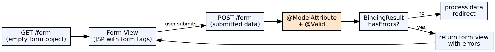

## The Problem

HTML forms submit data that must be extracted, validated, bound to objects, and re-displayed with error messages on failure. Manual form handling requires tedious request parameter extraction, field-by-field validation, and error tracking — all duplicated across every form in the application.

## Core Idea

Spring MVC provides comprehensive form handling: `@ModelAttribute` binds form fields to Java objects, `@Valid` triggers Bean Validation annotations, and `BindingResult` captures validation errors for display in the view. Spring form tags (`<form:form>`, `<form:input>`, `<form:errors>`) integrate with the model for seamless two-way binding.

## How It Works

1. **Form backing object**: A Java bean (POJO) holds form data; added to model via `@ModelAttribute`
2. **GET request**: Controller adds empty/ pre-populated form object to model, returns form view
3. **Form submission**: POST request with form fields → Spring binds fields to `@ModelAttribute` parameters
4. **Validation**: `@Valid` on the parameter triggers annotation validation; errors go to `BindingResult` (must be immediately after the validated parameter)
5. **Error handling**: If `BindingResult.hasErrors()`, return to form view — errors display via `<form:errors>`
6. **Success**: If no errors, process data (save to DB) and redirect (POST-Redirect-GET pattern)

## Visual Explanation

## Key Properties

- **@ModelAttribute**: Binds form fields to Java object fields by name match
- **@Valid / @Validated**: Triggers Bean Validation (JSR-380) annotations like `@NotBlank`, `@Email`, `@Size`
- **BindingResult**: Must immediately follow @Valid parameter; holds field and global errors
- **Spring form tags**: `<form:form>`, `<form:input>`, `<form:errors>` — automatically populate and display errors
- **POST-Redirect-GET**: Prevents duplicate form submission on refresh by redirecting after successful POST
- **Type conversion**: Automatic conversion from String (form field) to int, long, date, etc.

## Connections

- **Built from:** [[spring-mvc|Spring MVC]] — Form handling is part of Spring MVC's web functionality
- **Built from:** [[spring-controller|Spring Controller]] — Controller methods handle form GET and POST
- **Related:** [[spring-mvc-exception-handling|Spring MVC Exception Handling]] — Validation errors are distinct from exceptions
- **Related:** [[java-try-catch-finally|Try-Catch-Finally]] — BindingResult tracks validation errors similarly to structured error collection

## Edge Cases & Gotchas

- **BindingResult position**: Must immediately follow the @Valid parameter — any fields between them cause binding failure
- **Errors on GET**: First GET request has no BindingResult — use separate method or check if it's a rebind
- **Nested properties**: `@Valid` on nested objects requires cascading validation (`@Valid` on the nested field)
- **Conversion errors**: Type mismatch (e.g., "abc" for int field) goes to BindingResult as a FieldError
- **Custom validators**: Implement `Validator` interface and register; or use `@Pattern` for simple regex validation

## Sources

- [[java3-summary|Advanced Java Tutorial — Source Summary]] — Form handling in Spring MVC
