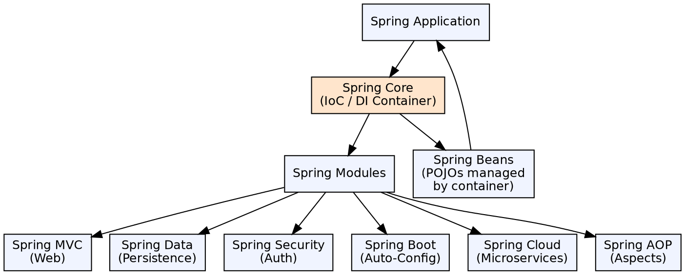

## The Problem

Enterprise Java development requires handling cross-cutting concerns (transactions, security, logging) alongside business logic. Without a framework, these concerns get scattered across the codebase (cross-cutting) and tangled with business code, making applications hard to develop, test, and maintain.

## Core Idea

Spring is a lightweight, modular Java application framework centered on Inversion of Control (IoC) and Dependency Injection (DI). It provides infrastructure for managing objects (beans), wiring dependencies, and integrating with enterprise services (transactions, persistence, messaging, web) through a consistent programming model.

## How It Works

1. **Bean container**: Spring's IoC container (ApplicationContext) manages object creation, wiring, and lifecycle
2. **Configuration metadata**: Beans are defined via XML, annotations, or Java config (`@Configuration`)
3. **Dependency Injection**: The container injects dependencies into beans at construction time, eliminating `new` calls
4. **Aspect-Oriented Programming**: Spring AOP weaves cross-cutting concerns (transactions, security) into beans without modifying business code
5. **Modular architecture**: Spring is organized into modules: Core, MVC, Data, Security, Cloud, Boot — use what you need

## Visual Explanation

## Key Properties

- **Lightweight**: No application server required; runs in any JVM with a servlet container (Tomcat)
- **POJO-based**: Business objects are plain Java objects with no Spring coupling (except annotations)
- **Non-invasive**: Application code doesn't extend Spring classes or implement Spring interfaces
- **Modular**: Choose only the modules your application needs
- **Testable**: DI makes unit testing trivial — mock dependencies can be injected in tests
- **Integration**: First-class support for Hibernate, JPA, JDBC, JMS, JTA, JNDI

## Connections

- **Built from:** [[spring-ioc-container|Spring IoC Container]] — Core of Spring, manages beans and DI
- **Builds into:** [[spring-mvc|Spring MVC]] — Web framework built on Spring Core
- **Builds into:** [[spring-boot|Spring Boot]] — Auto-configuration on top of Spring Framework
- **Builds into:** [[spring-security|Spring Security]] — Security built on Spring AOP and DI
- **Related:** [[component-architecture-soa|Component Architecture & SOA]] — Both Spring and EJB address component-based enterprise development
- **Contrasts with:** [[session-bean|EJB Session Bean]] — Spring beans are lighter, no EJB container needed

## Edge Cases & Gotchas

- **Configuration hell**: Too many XML/annotation configurations can become as hard to manage as the problems Spring solves
- **Circular dependencies**: Bean A depends on B which depends on A causes container startup failure; use setter injection or @Lazy
- **Proxy limitations**: Spring AOP (JDK dynamic proxies) only intercepts public method calls on Spring-managed beans
- **Over-autowiring**: Auto-wiring everything makes dependency graphs implicit and hard to trace

## Sources

- [[java3-summary|Advanced Java Tutorial — Source Summary]] — Spring Framework overview, architecture, IoC, DI
