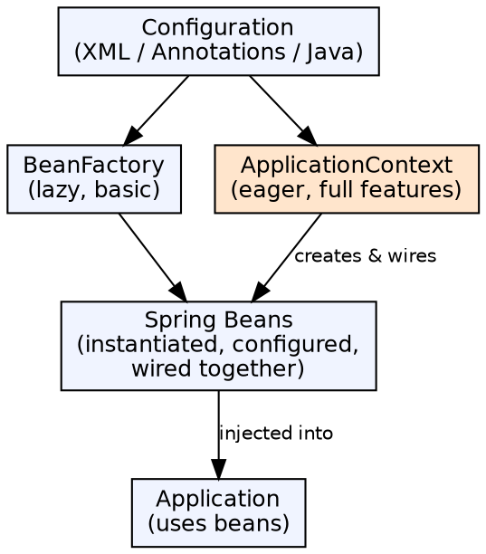

## The Problem

In traditional Java applications, each object creates its own dependencies using `new` — tightly coupling classes to their collaborators. This coupling makes it hard to swap implementations, test in isolation, or change application behavior without editing source code.

## Core Idea

The Spring IoC (Inversion of Control) Container is responsible for instantiating, configuring, and managing the lifecycle of Java objects (beans). Instead of objects creating their dependencies, the container creates everything and injects dependencies into objects. Two container types exist: BeanFactory (basic) and ApplicationContext (feature-rich).

## How It Works

1. **BeanFactory**: The simplest container providing basic DI support. Lazy-initializes beans by default. Suitable for resource-constrained environments (mobile, applets)
2. **ApplicationContext**: Extends BeanFactory with enterprise features: event publishing, message i18n, AOP integration, declarative startup, and web application support. Eager-initializes singletons by default. Used in virtually all Spring applications
3. **Configuration**: Beans defined via XML (`<bean>`), annotations (`@Component`, `@Service`), or Java config (`@Bean` in `@Configuration` class)
4. **Instantiation**: Container reads configuration, validates bean definitions, resolves dependencies, and creates bean instances
5. **Injection**: Dependencies injected via constructor, setter, or field (using `@Autowired`)

## Visual Explanation

## Key Properties

- **Inversion of Control**: Container controls bean lifecycle, not the application code
- **Dependency Injection**: Dependencies provided automatically; objects don't look them up
- **Lazy vs Eager**: BeanFactory lazy-initializes; ApplicationContext eagerly initializes singletons
- **Bean scopes**: singleton (default), prototype, request, session, application, websocket
- **Lifecycle callbacks**: `@PostConstruct`, `@PreDestroy`, `InitializingBean`, `DisposableBean`

## Connections

- **Built from:** [[spring-framework|Spring Framework]] — IoC container is the core of Spring
- **Builds into:** [[spring-bean-lifecycle|Spring Bean Lifecycle]] — The container manages every phase of a bean's lifecycle
- **Builds into:** [[spring-autowiring|Spring Autowiring]] — Autowiring is the DI resolution mechanism within the container
- **Related:** [[ejb-context|EJB Context]] — Both provide access to container services
- **Contrasts with:** [[home-interface|EJB Home Interface]] — EJB uses JNDI lookups; Spring uses DI

## Edge Cases & Gotchas

- **Startup cost**: ApplicationContext initialization scans classpath, creates all singletons — can be slow with many beans
- **Memory**: Eager initialization means all singleton beans stay in memory even if unused in the current request
- **BeanFactory vs ApplicationContext**: Never use raw BeanFactory in modern Spring unless memory is constrained; ApplicationContext is always preferred
- **Configuration precedence**: Java config > annotations > XML — mixing them requires understanding the override order