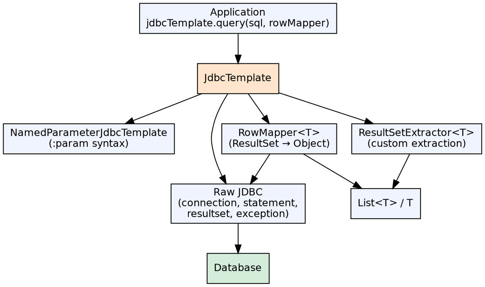

## The Problem

Raw JDBC requires manually managing every step of database access: getting a connection, creating a statement, setting parameters, iterating a ResultSet, handling checked SQLExceptions, and closing resources in finally blocks. A simple query becomes 15+ lines of repetitive, error-prone boilerplate.

## Core Idea

Spring JDBC Template provides a template-based API that eliminates JDBC boilerplate. `JdbcTemplate` wraps the JDBC workflow: it handles connection acquisition, statement creation, parameter binding, result extraction, and cleanup. Developers provide only the SQL and the logic to map results to objects.

## How It Works

1. **JdbcTemplate**: Core class wrapping JDBC — execute query/update with automatic resource management
2. **NamedParameterJdbcTemplate**: Uses named parameters (`:name`) instead of positional (`?`) — more readable, especially with many parameters
3. **RowMapper**: `(ResultSet rs, int rowNum) → T` maps a result set row to a domain object
4. **ResultSetExtractor**: For custom result extraction (e.g., building a Map from multiple rows)
5. **SQL scripts**: `ResourceDatabasePopulator` or `ScriptUtils` for executing SQL scripts during testing or setup

## Visual Explanation

## Key Properties

- **JdbcTemplate**: Simplest template — positional `?` parameters, automatic resource cleanup
- **NamedParameterJdbcTemplate**: Named `:param` parameters, better readability, uses SqlParameterSource
- **SimpleJdbcTemplate** (deprecated): Legacy wrapper, replaced by JdbcTemplate
- **RowMapper**: Maps individual rows — reusable, no external state
- **ResultSetExtractor**: Processes entire ResultSet (multiple rows, custom structures)
- **SQL scripts**: Execute SQL files via `ResourceDatabasePopulator` for setup, testing, or migrations
- **PreparedStatementCallback**: For full control over PreparedStatement creation and execution

## Connections

- **Built from:** [[java-jdbc|JDBC]] — JdbcTemplate is a wrapper over raw JDBC
- **Built from:** [[spring-framework|Spring Framework]] — JdbcTemplate is a Spring module for data access
- **Contrasts with:** [[spring-orm|Spring ORM]] — JdbcTemplate is direct SQL; Spring ORM is object-oriented
- **Contrasts with:** [[spring-data-jpa|Spring Data JPA]] — JdbcTemplate gives SQL control; JPA abstracts SQL
- **Related:** [[hql|Hibernate Query Language]] — Both execute database queries; HQL is ORM-based, JdbcTemplate is SQL-based

## Edge Cases & Gotchas

- **Large results**: JdbcTemplate fetches all results into memory by default — use `RowCallbackHandler` or streaming for large datasets
- **No caching**: Unlike ORM, JdbcTemplate has no built-in caching — each query hits the database
- **No lazy loading**: All fields must be explicitly selected; no proxy-based lazy loading
- **SQL injection**: Always use parameterized queries (`?` or `:param`), never concatenate user input into SQL strings
- **DataSource configuration**: JdbcTemplate needs a properly configured DataSource bean; Spring Boot auto-configures one

## Sources

- [[java3-summary|Advanced Java Tutorial — Source Summary]] — Spring JDBC Template, NamedParameterJdbcTemplate
