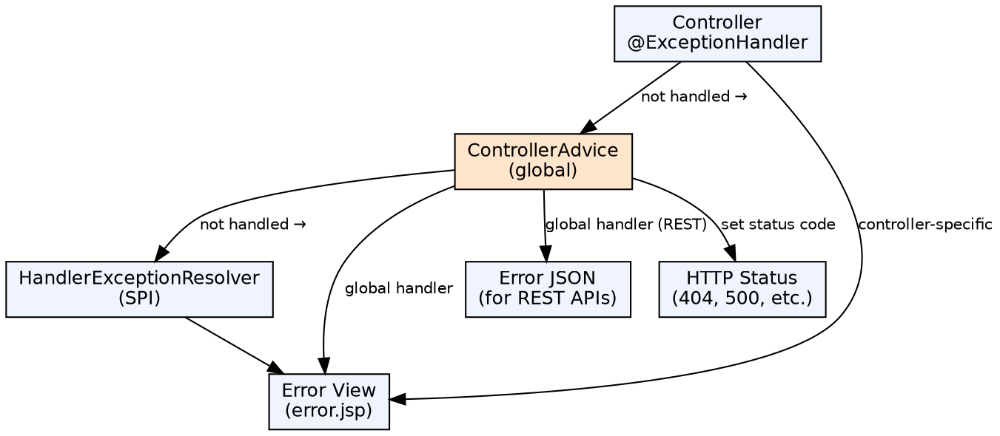

## The Problem

Web application errors (404, 500, validation failures, data access errors) can occur in any controller method. Without centralized handling, every method needs try-catch blocks, error view selection, and status code mapping — leading to duplicated error-handling code and inconsistent error responses.

## Core Idea

Spring MVC provides a layered exception handling architecture: `@ExceptionHandler` on controllers handles controller-specific exceptions, `@ControllerAdvice` provides global exception handling across all controllers, and `HandlerExceptionResolver` is the lowest-level SPI for complete customization.

## How It Works

1. **Controller-level**: `@ExceptionHandler(SomeException.class)` methods in the same controller catch specific exceptions
2. **Global-level**: `@ControllerAdvice` classes contain `@ExceptionHandler` methods that apply to all controllers
3. **Resolution order**: Controller-level → ControllerAdvice → HandlerExceptionResolver chain
4. **Error views**: Exception handler returns ModelAndView with error details and status codes
5. **REST errors**: `@RestControllerAdvice` returns error JSON instead of error views
6. **ResponseEntity**: ExceptionHandler methods can return `ResponseEntity<ErrorResponse>` for full HTTP response control

## Visual Explanation

## Key Properties

- **@ExceptionHandler**: Method-level annotation for handling specific exception types within a controller
- **@ControllerAdvice**: Global exception handling across all controllers; also adds model attributes globally
- **@RestControllerAdvice**: @ControllerAdvice + @ResponseBody, for REST APIs returning JSON error responses
- **HandlerExceptionResolver**: Interface for custom exception resolution logic; lowest level
- **Status codes**: `@ResponseStatus(HttpStatus.NOT_FOUND)` sets HTTP status on exceptions
- **ErrorAttributes**: Spring Boot provides default error attributes (timestamp, status, error, message, path)

## Connections

- **Built from:** [[spring-mvc|Spring MVC]] — Exception handling is integral to Spring MVC's request processing
- **Built from:** [[spring-controller|Spring Controller]] — @ExceptionHandler methods live in controllers or @ControllerAdvice
- **Related:** [[spring-form-handling|Spring Form Handling]] — Validation errors (BindingResult) versus exception handling
- **Contrasts with:** [[java-try-catch-finally|Try-Catch-Finally]] — Java try-catch is imperative; Spring MVC exception handling is declarative and cross-cutting

## Edge Cases & Gotchas

- **HandlerExceptionResolver vs @ExceptionHandler**: @ExceptionHandler cannot control response status for unhandled exceptions; HandlerExceptionResolver can
- **Async exceptions**: Exceptions in @Async methods or DeferredResult need separate handling (AsyncExceptionHandler)
- **ResponseStatusException**: Spring 5+ provides `ResponseStatusException` for programmatic status + reason without custom exception classes
- **Security exceptions**: Spring Security exceptions are handled by the Security filter chain, not ControllerAdvice

## Sources

- [[java3-summary|Advanced Java Tutorial — Source Summary]] — Exception handling in Spring MVC
