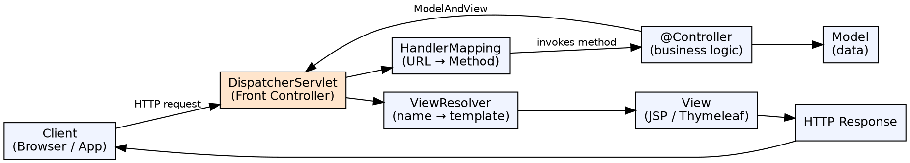

## The Problem

Building web applications requires handling HTTP requests, mapping URLs to handlers, parsing parameters, validating input, rendering views, and managing sessions. Without a structured framework, web-tier code becomes a messy mix of request handling, business logic, and presentation.

## Core Idea

Spring MVC is a web framework built on the Model-View-Controller pattern, with the DispatcherServlet as the front controller. It cleanly separates concerns: Controllers handle requests, Models hold data, and Views render output. The framework handles request routing, parameter binding, validation, and view resolution transparently.

## How It Works

1. **DispatcherServlet**: The front controller receives all HTTP requests and delegates to configured components
2. **Handler mapping**: DispatcherServlet consults HandlerMapping to find which controller method handles the request URL
3. **Controller execution**: The selected `@Controller` method executes, processes the request, and returns a ModelAndView
4. **View resolution**: ViewResolver maps logical view names (e.g., "home") to actual view templates (home.jsp, home.html)
5. **Response rendering**: View renders the model data into HTML, JSON, or XML

## Visual Explanation

## Key Properties

- **Front controller pattern**: DispatcherServlet centralizes request handling
- **Annotation-based**: `@Controller`, `@RequestMapping`, `@RequestParam`, `@ModelAttribute`
- **View technology agnostic**: Works with JSP, Thymeleaf, FreeMarker, Mustache
- **REST support**: `@RestController` combines `@Controller` + `@ResponseBody` for JSON/XML APIs
- **Data binding**: Automatically binds request parameters to Java objects
- **Validation**: `@Valid` + `BindingResult` for declarative input validation

## Connections

- **Built from:** [[spring-framework|Spring Framework]] — Spring MVC is built on Spring Core (IoC, DI)
- **Built from:** [[dispatcher-servlet|DispatcherServlet]] — The front controller is the entry point of Spring MVC
- **Related:** [[spring-controller|Spring Controller]] — @Controller methods handle specific request mappings
- **Builds into:** [[spring-boot|Spring Boot]] — Spring Boot auto-configures Spring MVC with embedded Tomcat
- **Related:** [[spring-form-handling|Spring Form Handling]] — Form handling and validation in Spring MVC
- **Contrasts with:** [[jsp|JSP]] — JSP is a view technology; Spring MVC is a full web framework

## Edge Cases & Gotchas

- **Hidden HttpMethod**: HTML forms only support GET/POST; Spring's `HiddenHttpMethodFilter` converts `_method=PUT` to actual PUT
- **@ModelAttribute vs @RequestParam**: @ModelAttribute binds complex objects; @RequestParam binds single parameters
- **ViewResolver chaining**: Multiple ViewResolvers with order priority — first match wins
- **async requests**: DeferredResult and Callable for long-lived async processing in controllers

## Sources

- [[java3-summary|Advanced Java Tutorial — Source Summary]] — Spring MVC overview, architecture
