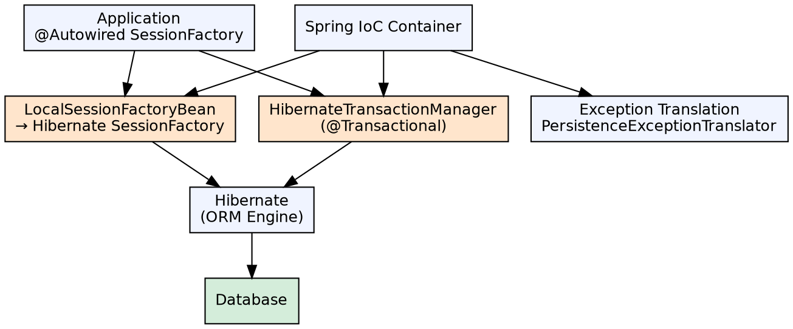

## The Problem

Using Hibernate directly requires manually managing SessionFactory, Sessions, and transactions. Each operation needs opening a session, beginning a transaction, performing the operation, committing or rolling back, and closing the session. This boilerplate leads to resource leaks and inconsistent transaction boundaries.

## Core Idea

Spring ORM provides a consistent integration layer between Spring and ORM frameworks (Hibernate, JPA, MyBatis). It centralizes SessionFactory creation, provides automatic session management via `HibernateTemplate`, integrates with Spring's transaction management, and translates Hibernate exceptions into Spring's `DataAccessException` hierarchy.

## How It Works

1. **LocalSessionFactoryBean**: Spring creates a Hibernate SessionFactory as a Spring bean, configuring it via Spring's property management
2. **HibernateTransactionManager**: Connects Hibernate's transaction API to Spring's platform transaction management — enables `@Transactional` on Hibernate operations
3. **Session management**: Spring opens and closes Hibernate Sessions automatically per operation (OpenSessionInView pattern)
4. **Exception translation**: `@Repository` + `PersistenceExceptionTranslationPostProcessor` translates Hibernate exceptions to Spring's `DataAccessException`
5. **Automatic table creation**: Hibernate's `hibernate.hbm2ddl.auto` property (create, update, validate) automatically generates DDL from entity mappings

## Visual Explanation

## Key Properties

- **Centralized config**: Hibernate properties (dialect, DDL auto, connection pool) configured in Spring, not hibernate.cfg.xml
- **Automatic session**: No session.open()/close() needed — Spring manages the lifecycle
- **Transaction integration**: Standard `@Transactional` works with Hibernate operations
- **Exception translation**: Vendor-specific exceptions → Spring's unified DataAccessException hierarchy
- **Automatic DDL**: `hibernate.hbm2ddl.auto` generates database tables from entity classes
- **Lazy loading support**: OpenSessionInViewFilter keeps session open during view rendering (controversial)

## Connections

- **Built from:** [[spring-framework|Spring Framework]] — Spring ORM is a Spring module for ORM integration
- **Built from:** [[hibernate-orm-framework|Hibernate ORM Framework]] — Spring ORM integrates Hibernate as the ORM provider
- **Builds into:** [[spring-data-jpa|Spring Data JPA]] — Spring Data JPA uses Spring ORM under the hood for Hibernate integration
- **Related:** [[spring-jdbc-template|Spring JDBC Template]] — Both Spring ORM and JDBC Template are data access approaches in Spring
- **Contrasts with:** [[container-managed-persistence|Container-Managed Persistence]] — CMP is EJB's ORM; Spring ORM is more flexible and standalone

## Edge Cases & Gotchas

- **OpenSessionInView anti-pattern**: Keeping the session open during view rendering encourages lazy loading outside transactional boundaries, leading to N+1 queries hidden in views
- **SessionFactory per data source**: Multiple databases require separate SessionFactory beans
- **Hibernate version conflicts**: Spring Boot manages Hibernate version; manual dependency management can cause incompatibilities
- **DDL auto in production**: Never use `hibernate.hbm2ddl.auto=create` or `update` in production — use `validate` or Flyway/Liquibase

## Sources

- [[java3-summary|Advanced Java Tutorial — Source Summary]] — Spring ORM integration with Hibernate
