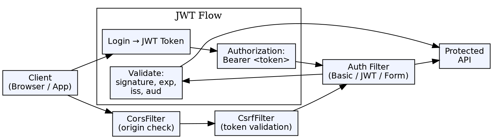

## The Problem

Web applications face two critical security challenges: Cross-Site Request Forgery (CSRF) tricks authenticated users into performing unintended actions, and Cross-Origin Resource Sharing (CORS) policies prevent legitimate cross-domain requests. Additionally, stateless authentication (JWT) needs careful implementation to avoid token theft and replay attacks.

## Core Idea

Spring Security provides built-in CSRF protection (synchronizer token pattern, enabled by default for state-changing requests) and CORS configuration (allowing specified origins, methods, and headers). For JWT authentication, Spring Security integrates with `BearerTokenAuthenticationFilter` to validate signed tokens on every request without server-side session state.

## How It Works

1. **CSRF protection**: Server generates a unique token, embedded in forms or sent via header. State-changing requests (POST/PUT/DELETE) must include this token. The `CsrfFilter` validates it against the stored token
2. **CORS**: `CorsFilter` checks `Origin` header against allowed origins. Spring Security configures via `.cors()` and `@CrossOrigin` on controllers
3. **JWT authentication**: Client sends JWT in `Authorization: Bearer <token>` header. `BearerTokenAuthenticationFilter` extracts and validates token signature and claims
4. **JWT validation**: Verify signature (HMAC or RSA), check expiration (`exp` claim), verify issuer (`iss`) and audience (`aud`)
5. **Stateless sessions**: `SessionCreationPolicy.STATELESS` — no HTTP session, every request fully authenticated

## Visual Explanation

## Key Properties

- **CSRF default**: Enabled by default for web apps; disabled automatically for REST APIs (stateless)
- **CORS configuration**: Allowed origins, methods, headers, credentials, and max age via `CorsConfigurationSource`
- **@CrossOrigin**: Per-controller CORS configuration for specific endpoints
- **JWT Bearer tokens**: `spring-boot-starter-oauth2-resource-server` for JWT validation
- **Token validation**: Signature, expiration (`exp`), not-before (`nbf`), issuer (`iss`), audience (`aud`)
- **Stateless architecture**: JWT enables stateless auth — no server-side session, scales horizontally

## Connections

- **Built from:** [[spring-security|Spring Security]] — CSRF, CORS, and JWT are Spring Security modules
- **Built from:** [[spring-security-authentication|Spring Security Authentication]] — JWT provides bearer token authentication
- **Related:** [[jwt-authentication|JWT Authentication]] — The JWT token concept; Spring Security implements JWT validation
- **Related:** [[cors|CORS]] — CORS is an HTTP mechanism; Spring Security configures it
- **Contrasts with:** [[jaas|JAAS]] — JAAS is container-managed; Spring Security JWT is application-managed and stateless

## Edge Cases & Gotchas

- **CSRF with REST APIs**: If using stateless sessions (JWT), disable CSRF — there's no session to protect
- **CSRF with file upload**: Multipart requests need CSRF token in URL parameter or separate header
- **JWT revocation**: JWT tokens can't be revoked before expiration (no server-side state) — use short expirations + refresh tokens
- **CORS vs CSRF**: CORS is about cross-origin access; CSRF is about request forgery — they address different threats
- **Bearer token storage**: Storing JWT in localStorage is vulnerable to XSS; httpOnly cookies are safer but require CSRF protection
- **JWT size**: Large JWT tokens with many claims can exceed header size limits — keep claims minimal

## Sources

- [[java3-summary|Advanced Java Tutorial — Source Summary]] — CSRF, CORS, JWT in Spring Security
