## The Problem

Securing enterprise applications requires implementing authentication (who are you?), authorization (what can you do?), and protection against common attacks (CSRF, session fixation, clickjacking). Doing this correctly is hard — rolling custom security is error-prone and leads to vulnerabilities.

## Core Idea

Spring Security is a comprehensive security framework for Java applications providing authentication, authorization, and protection against common exploits. It uses a filter chain architecture that intercepts every HTTP request, applies configured security rules, and integrates with various authentication providers (database, LDAP, OAuth2, JWT).

## How It Works

1. **Security filter chain**: A chain of servlet filters processes every request. Key filters: `UsernamePasswordAuthenticationFilter` (form login), `BasicAuthenticationFilter` (HTTP Basic), `FilterSecurityInterceptor` (authorization)
2. **Authentication**: User credentials → `AuthenticationProvider` validates → `SecurityContextHolder` stores the `Authentication` object for the request
3. **Authorization**: `@PreAuthorize("hasRole('ADMIN')")` or `AccessDecisionManager` checks if the authenticated user has the required authority
4. **CSRF protection**: Synchronizer token pattern — generated token embedded in forms, validated on state-changing requests
5. **Security annotations**: `@Secured`, `@PreAuthorize`, `@PostAuthorize`, `@PreFilter`, `@PostFilter`
6. **UserDetailsService**: Interface for loading user-specific data (typically from a database)

## Visual Explanation

```dot
digraph spring_security {
  rankdir=LR
  node [shape=box style=filled fillcolor="#f0f4ff" fontname="Helvetica" fontsize=12]
  edge [fontname="Helvetica" fontsize=10]

  REQ [label="HTTP Request"]
  FILTERS [label="Security Filter Chain" fillcolor="#ffe5cc"]
  AUTH [label="Authentication\n(UsernamePasswordAuthenticationFilter)"]
  AUTHZ [label="Authorization\n(FilterSecurityInterceptor)"]
  PROVIDER [label="AuthenticationProvider\n(DB / LDAP / OAuth2 / JWT)"]
  CTX [label="SecurityContextHolder\n(ThreadLocal)"]
  ACCESS [label="Access Granted/Denied"]
  RESP [label="HTTP Response\n(200 / 401 / 403)"]

  REQ -> FILTERS
  FILTERS -> AUTH
  AUTH -> PROVIDER [label="validate credentials"]
  PROVIDER -> CTX [label="store Authentication"]
  CTX -> AUTHZ [label="check authorities"]
  AUTHZ -> ACCESS
  ACCESS -> RESP
}
```

## Key Properties

- **Filter chain**: Modular, ordered chain of security filters, each handling one concern
- **Authentication providers**: DAO (database), LDAP, OAuth2, JWT, remember-me, custom
- **Authorization methods**: URL-based (`.antMatchers().hasRole()`), method-based (`@PreAuthorize`)
- **CSRF protection**: Enabled by default for state-changing POST/PUT/DELETE requests
- **Security headers**: Default headers for XSS, content-type sniffing, clickjacking, HSTS
- **Password encoding**: `PasswordEncoder` interface with BCrypt, SCrypt, Argon2 implementations
- **JSP tag library**: `<sec:authorize access="hasRole('ADMIN')">` for view-level security

## Connections

- **Built from:** [[spring-framework|Spring Framework]] — Spring Security builds on Spring AOP and DI
- **Related:** [[spring-security-authentication|Spring Security Authentication]] — Core authentication mechanisms
- **Related:** [[spring-security-csrf-jwt|Spring Security CSRF and JWT]] — CSRF protection and JWT authentication
- **Related:** [[jaas|JAAS]] — JAAS is the standard Java auth API; Spring Security is the framework approach
- **Contrasts with:** [[session-authentication|Session Authentication]] — Session auth is simpler; Spring Security provides comprehensive enterprise security

## Edge Cases & Gotchas

- **Filter order**: Security filters must come before Spring MVC's DispatcherServlet in the filter chain
- **@EnableWebSecurity vs XML**: Java config is preferred; mixing with XML can cause unexpected behavior
- **SecurityContext persistence**: In web apps, SecurityContext is stored in the HTTP session — ensure session management is configured
- **Async security**: `@Async` methods lose SecurityContext — use `SecurityContextRunnable` or `DelegatingSecurityContextAsyncTaskExecutor`
- **Whitelabel error page**: Spring Security's default error page appears when access is denied — customize with proper error handling

## Sources

- [[java3-summary|Advanced Java Tutorial — Source Summary]] — Spring Security, authentication, authorization, architecture
