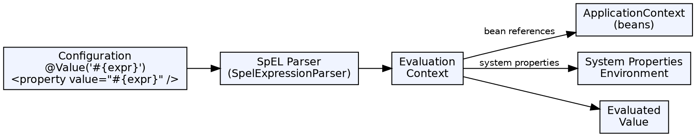

## The Problem

Configuration values and bean wiring often require dynamic expressions — accessing system properties, evaluating conditions, performing string operations, or calling methods. Static property files (`@Value("${key}")`) can only do basic key lookups; developers need runtime expression evaluation within the Spring container.

## Core Idea

SpEL (Spring Expression Language) is a powerful expression language that supports querying and manipulating objects at runtime. It can be used in XML and annotation-based configurations, providing dynamic value resolution, method invocation, collection manipulation, and boolean evaluation.

## How It Works

1. **Syntax**: Expressions start with `#{` and end with `}` — e.g., `#{systemProperties['user.dir']}`
2. **Property access**: `#{beanName.property}` accesses any Spring bean's property
3. **Method invocation**: `#{beanName.method(args)}` calls methods on beans
4. **Operators**: Arithmetic (`+`, `-`, `*`, `/`), relational (`==`, `lt`, `gt`), logical (`and`, `or`, `not`)
5. **Collection selection**: `#{users.?[age > 25]}` filters collections; `.^` first match, `.$` last match
6. **Collection projection**: `#{users.![name]}` extracts specific property from each element
7. **Safe navigation**: `#{bean?.property}` — returns null if bean is null instead of NPE
8. **Ternary**: `#{bean.score > 50 ? 'Pass' : 'Fail'}`

## Visual Explanation

## Key Properties

- **Dynamic evaluation**: Expressions are evaluated at runtime, not compile time
- **Bean access**: Directly reference Spring beans by name (`#{myBean.count}`)
- **Null-safe**: `?.` operator prevents NullPointerException in navigation chains
- **Collection operators**: Selection (`?[]`), projection (`![]`), sorting according to a property
- **Type operators**: `T(java.lang.Math).PI` references static types and methods
- **Integration**: Works with `@Value`, XML `<property>`, security annotations, and more

## Connections

- **Built from:** [[spring-framework|Spring Framework]] — SpEL is a Spring Core module
- **Built from:** [[spring-ioc-container|Spring IoC Container]] — SpEL evaluates within the container's context
- **Related:** [[spring-annotations|Spring Annotations]] — @Value with SpEL provides dynamic property injection
- **Contrasts with:** [[ejb-ql|EJB Query Language (EJB-QL)]] — EJB-QL queries entities; SpEL queries beans and system properties
- **Related:** [[java-operators|Java Operators]] — SpEL operators extend Java's with collection-safe operations

## Edge Cases & Gotchas

- **Syntax confusion**: `#{}` (SpEL evaluation) vs `${}` (property placeholder) — they can be nested: `#{${property}}`
- **Performance**: Complex SpEL expressions are evaluated on every access — avoid in hot paths
- **Method invocation**: Only public methods on beans can be called; private/static methods require T() type operator
- **Security**: SpEL can call any bean method and access any property — never use user-provided input in SpEL expressions (security risk)