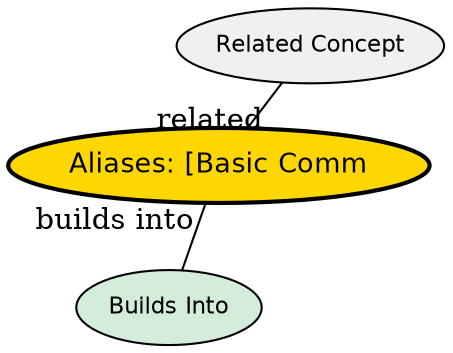

## The Problem

New Vim users are lost without familiarity of any commands. Without these five commands, you cannot open a file, save it, or do anything productive.

## Core Idea

Five core Normal-mode commands are enough to survive: insert text, delete characters, save, and quit.

## How It Works

Essential commands for Level 1 (Survival):

| Command | Action                                   |
| ------- | ---------------------------------------- |
| `i`     | Enter Insert mode (type text)            |
| `x`     | Delete character under cursor            |
| `:wq`   | Save and quit (`:w` = save, `:q` = quit) |
| `dd`    | Delete (cut) the current line            |
| `p`     | Paste the last deleted/yanked text       |

Recommended additions:

- `hjkl` -- cursor movement (←↓↑→), `j` looks like down arrow
- `:help <command>` -- show help for any command (`:help` for general help)

## Key Properties

- All five commands work in Normal mode
- `dd` both deletes and yanks (stores in default register)
- `:wq` fails if file is read-only -- use `:wq!` to force
- `p` pastes after cursor, `P` pastes before cursor

## Edge Cases & Gotchas

- `x` works on characters, not bytes in multi-byte encodings
- `dd` copies to register, so `p` can retrieve it
- `:wq` saves even without changes -- use `:x` to save only if modified

## Visual Explanation

## Semantic Network

## Connections

- [[vim-modes|Vim Modes]] -- All commands work in Normal mode
- [[vim-text-objects|Text Objects]] -- Extend deletion/selection beyond single lines
- [[vim-search-navigation|Navigation]] -- Moving efficiently within lines and files
- [[vim-repetition|Repetition]] -- Repeat commands with counts