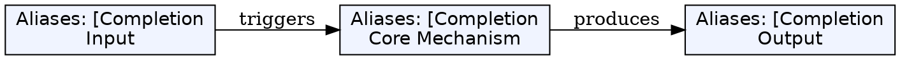
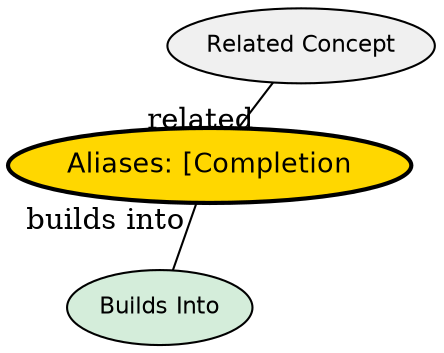

## The Problem

Retyping long identifiers or boilerplate text wastes time. Completion suggestions improve speed and reduce typos.

## Core Idea

In Insert mode, Vim provides keyword completion from the current buffer and loaded files.

## How It Works

Completion commands in Insert mode:
| Key | Action |
|-----|--------|
| `<C-n>` | Next match |
| `<C-p>` | Previous match |
| `<C-x><C-l>` | Line completion |
| `<C-x><C-f>` | Filename completion |

Workflow:

1. Type the start of a word
2. Press `<C-n>` or `<C-p>` to cycle through suggestions
3. Accept with right arrow or completion key
4. Continue typing or press `<C-n>` for more options

## Key Properties

- Completion is keyword-based from open buffers
- Searches all loaded buffers, not just current
- `<C-n>` / `<C-p>` cycle through matches
- Works with dictionaries, thesaurus, and more via plugins

## Edge Cases & Gotchas

- Need at least one charactertyped before completion works
- Dictionary completion via `'dictionary'` option
- LSP completion is separate (see LSP wiki for language-aware)

## Visual Explanation

## Semantic Network

## Connections

- [[language-server-protocol|Language Server Protocol]] -- Language-aware completion (vs basic word completion)
- [[vim-modes|Vim Modes]] -- Completion in Insert mode
- [[vim-basic-commands|Survival Commands]] -- Insert mode basics
- [[vim-repetition|Repetition]] -- Can repeat insertions