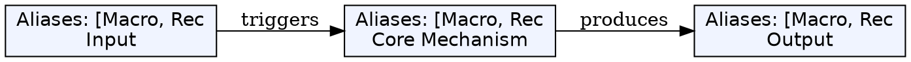
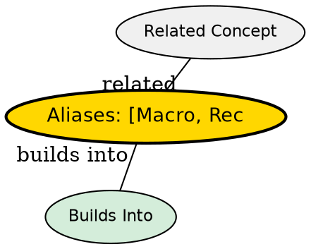

## The Problem

Repetition with `.` is limited to the last change. Complex multi-step sequences need more powerful automation.

## Core Idea

Macros record and replay sequences of Normal-mode commands using registers (a-z).

## How It Works

Recording workflow:

1. `qa` -- start recording to register `a` (shows `recording @a`)
2. Perform the sequence of commands
3. `q` -- stop recording
4. `@a` -- replay the macro
5. `@@` -- replay last executed macro

Example: Numbered list

1. Place cursor on line with `1`
2. `qaYp<C-a>q` -- record: yank line, paste, increment number, stop
3. `@a` -- writes 2 below 1
4. `@@` -- writes 3 below 2
5. `100@@` -- creates 1 through 103

## Key Properties

- Registers are named a-z (26 total)
- Uppercase registers append: `qA` appends to register `a`
- Macros persist until overwritten
- Works across files if registers are preserved

## Edge Cases & Gotchas

- Macros execute at Normal mode -- recording in Insert mode includes literal keystrokes
- `<C-a>` increments if cursor is on/on after a number
- `:reg` shows all register contents

## Visual Explanation

## Semantic Network

## Connections

- [[vim-repetition|Repetition]] -- Simpler than macros for single changes
- [[vim-modes|Vim Modes]] -- Recording works in Normal mode
- [[vim-visual-selection|Visual Selection]] -- Can record visual selections
- [[vim-rectangular-blocks|Block Selection]] -- Can be combined with macros