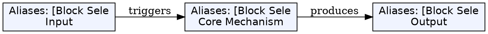
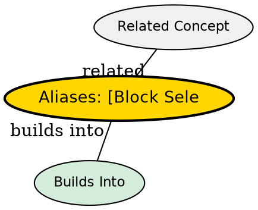

## The Problem

Editing multiple lines at the same column is common (indentation, commenting). Character/line selection can't handle this -- you need column-based selection.

## Core Idea

Block-wise visual mode (`<C-v>`) selects rectangular columns across multiple lines. This enables simultaneous edits to many lines at once.

## How It Works

Entry: `<C-v>` from Normal mode (or `<C-q>` on Windows if clipboard interferes)

Use cases:

- **Comment multiple lines**:
  1. `0` -- go to first column
  2. `<C-v>` -- start block selection
  3. `<C-d>` -- move down (or `jjj`, `%`, etc.)
  4. `I-- [ESC]` -- insert comment prefix on each line

- **Append to all lines**:
  1. `<C-v>` select blocks
  2. Move to target lines
  3. `$` -- extend to end of lines
  4. `A`, type text, `ESC`

Window commands:

- `<C-w><dir>` -- switch split (dir = h,j,k,l or arrows)
- `<C-w>_` -- maximize horizontal split
- `<C-w>|` -- maximize vertical split
- `<C-w>+` / `<C-w->` -- resize splits

## Key Properties

- Block selection persists during operations
- All selected lines get the same edit
- Case matters: `<C-v>` is block, `V` is line, `v` is character
- Works with `:split` and `:vsplit` for window splits

## Edge Cases & Gotchas

- Windows: `<C-q>` if `<C-v>` is clipboard paste
- `$` selects to end of longest line, not each line individually
- Block selection combined with `A` appends at line ends

## Visual Explanation

## Semantic Network

## Connections

- [[vim-visual-selection|Visual Selection]] -- Block selection is a variant
- [[vim-macros|Macros]] -- Can record block selection operations
- [[vim-text-objects|Text Objects]] -- Alternative selection syntax
- [[vim-splits|Vim Splits]] -- Related window functionality