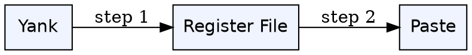
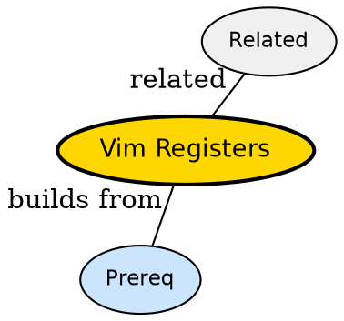

## The Problem

Yanking and deleting overwrites clipboard -- where did the last three yanks go and how do you paste an older one?

## Formal Definition

Per Wikipedia: "Vim registers are named clipboards; unnamed " holds last change, numbered 1-9 hold history, named a-z are explicit, +/* connect to system clipboard."

## Explanation

Registers are like labeled jars -- "a holds your pick, "1 holds yesterday's pick, "+ holds the shared jar with OS.

## How It Works

1. Yank puts text in "0 and unnamed
2. Delete puts in "1 shifting history
3. Paste with "ap pastes register a
4. "+p pastes system clipboard
5. ":p pastes last command

## Visual Explanation



## Semantic Network



## Key Properties

- "0 preserves yank over delete
- "_ is black hole -- no save
- "+ needs clipboard+ build

## Real-World Example

```python
"ayy # yank line to a
"ap # paste from a
:reg # show all
```

## Connections

- **Built from:** [[vim-modes|Vim Modes]] -- yank/paste across modes
- **Related:** [[vim-visual-selection|Vim Visual Selection]] -- visual yank uses registers
- **Related:** [[vim-macros|Vim Macros]] -- macros stored in registers
- **Related:** [[vim-buffers|Vim Buffers]] -- registers are per-session not per-buffer

## Edge Cases & Gotchas

- Expecting unnamed to survive deletes -- use "0
- Forgetting + vs * clipboard difference
