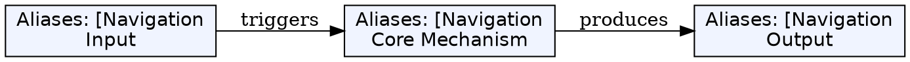
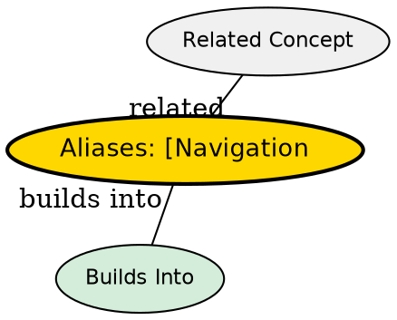

## The Problem

Moving inefficiently kills productivity. Cursor-by-cursor navigation doesn't scale for large files. Efficient editing requires efficient movement commands.

## Core Idea

Vim provides granular movement commands: character, word, line, search, and screen-level navigation.

## How It Works

### Line-level navigation:

| Key         | Destination                                       |
| ----------- | ------------------------------------------------- |
| `0`         | First column (column 0)                           |
| `^`         | First non-blank character                         |
| `$`         | End of line                                       |
| `g_`        | Last non-blank character                          |
| `fa`        | Next `a` on line (repeat with `;`, back with `,`) |
| `ta`        | Just before next `a`                              |
| `Fa` / `Ta` | Same, backward                                    |

### Word moves:

- `w` -- start of next word
- `e` -- end of current word
- `b` -- start of previous word

WORD vs word: word = alphanumeric + underscore; WORD = whitespace-separated

### File navigation:

- `gg` -- start of file (shortcut for `1G`)
- `G` -- last line
- `N G` -- line N

### Search:

- `/pattern` -- search forward, `?pattern` backward
- `*` -- search word under cursor forward
- `#` -- search word under cursor backward
- `%` -- jump to matching bracket (`, { or [)

## Key Properties

- All movement commands can be combined with operators: `d$`, `yG`, `ce`
- `*` is smart: uses word boundaries
- Counts work: `3w` moves 3 words; `5j` moves 5 lines down
- `n` repeats last search, `N` reverses

## Edge Cases & Gotchas

- `^` visually appears above `_` but is different
- `f` is line-local -- doesn't wrap by default, use `;` or search
- Word boundaries differ from TEXT objects boundaries

## Visual Explanation

## Semantic Network

## Connections

- [[vim-basic-commands|Survival Commands]] -- `hjkl` are basic movements
- [[vim-repetition|Repetition]] -- Combine with counts
- [[vim-modes|Vim Modes]] -- All work in Normal mode
- [[vim-visual-selection|Visual Selection]] -- Can use as motions