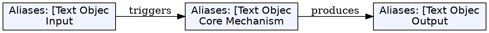
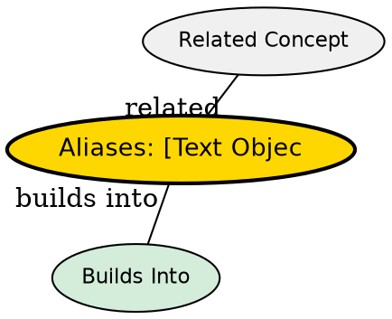

## The Problem

Single-character/single-line operations are inefficient when editing structured text (quotes, brackets, paragraphs). Manually counting or searching to select delimited blocks is error-prone.

## Core Idea

Text objects allow selecting delimited content (words, sentences, paragraphs, quoted strings, brackets) with two-character commands: `<action>i<object>` (inside) or `<action>a<object>` (around).

## How It Works

Pattern: `<action>a<object>` and `<action>i<object>`

- **action**: any operator (`d` delete, `y` yank, `v` select)
- **i**: inside (content only)
- **a**: around (including delimiters)

Common objects:
| Object | Meaning |
|--------|---------|
| `w` | word |
| `W` | WORD (whitespace-separated) |
| `s` | sentence |
| `p` | paragraph |
| `"` | double quotes |
| `'` | single quotes |
| `)` or `b` | parentheses |
| `]` | brackets |
| `}` | braces |
| `t` | tags (like `<html>`) |

## Key Properties

- `ci"` changes inside quotes without deleting the quotes
- `da"` includes the quotes in the deletion
- `v2i)` selects the inner two parentheses groups
- Count prefixes work: `d2i(` deletes two nested groups

## Edge Cases & Gotchas

- Visual mode doesn't need an action -- just `vi"` works
- Nested quotes: counts work (`ci""` -- inner pair in `"foo"bar"`)
- Objects are motion-compatible -- `y` works same as `d` (yanks)

## Visual Explanation

## Semantic Network

## Connections

- [[vim-modes|Vim Modes]] -- Requires Visual or Normal mode
- [[vim-basic-commands|Survival Commands]] -- Use operators like `d`, `y`
- [[vim-visual-selection|Visual Selection]] -- Text objects extend selection
- [[vim-repetition|Repetition]] -- Can repeat text object operations