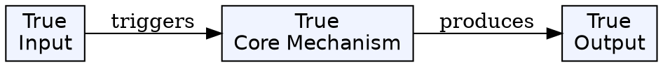
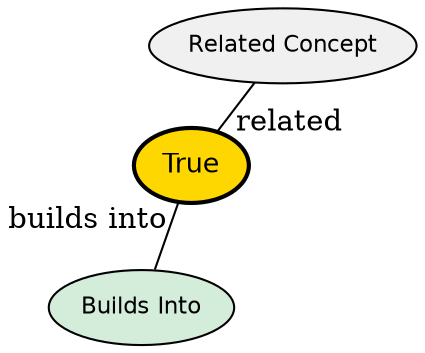

## The Problem

Code editors need to provide intelligent features like go-to-definition, refactoring, and completion. Before LSP, each language required custom integration with every editor--a massive N×M problem. LSP standardizes communication between tools and language analyzers.

## Core Idea

The Language Server Protocol (LSP) is a protocol that defines communication between a code editor (client) and a language analysis tool (server). LSP standardizes features like autocomplete, go-to-definition, find references, hover information, rename, and formatting across all languages.

## How It Works

1. **Client-Server Architecture**: The editor acts as an LSP client; the language analyzer runs as a separate process (language server)
2. **JSON-RPC Communication**: Messages are sent over stdin/stdout using JSON-RPC 2.0
3. **Standardized Methods**: Features are exposed via methods like `textDocument/definition`, `textDocument/completion`, `textDocument/rename`
4. **Initialization**: Client and server exchange capabilities during initialization
5. **Document Synchronization**: Server receives notifications when files change via `textDocument/didOpen`, `textDocument/didChange`, etc.

## Key Properties

- Language-agnostic protocol (works with any programming language)
- Server provides semantic, project-level analysis (unlike ctags)
- Bidirectional: client sends requests, server sends notifications and responses
- Capabilities negotiation: servers declare supported features
- Standardized request/response format

## Visual Explanation

## Semantic Network

## Connections

- **Built from:** JSON-RPC 2.0 -- underlying wire protocol
- **Builds into:** Neovim's vim.lsp -- specific client implementation
- **Related:** Treesitter -- alternative code understanding (syntax parsing vs LSP semantic analysis)
- **Related:** Ctags -- traditional navigation approach

## Edge Cases & Gotchas

- Servers are third-party; each language requires separate installation
- Not all servers implement all features--check capabilities
- Large projects may have performance issues with file watching
- Dynamic registration allows servers to add capabilities after initialization