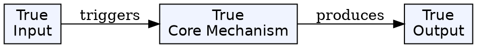
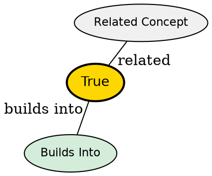

## The Problem

Once an LSP server is started, the editor needs to manage its state--track attached buffers, send requests, handle responses, and monitor capabilities. This requires an abstraction representing the active LSP connection.

## Core Idea

An LSP Client is a Neovim object representing an active connection to a language server. It holds the server's capabilities, attached buffers, pending requests, and methods for interaction.

## How It Works

1. **Creation**: `vim.lsp.start()` or `vim.lsp.enable()` creates a client from a config
2. **Retrieval**: `vim.lsp.get_client_by_id(id)`, `vim.lsp.get_clients({filter})`
3. **Capabilities**: `client.server_capabilities` exposes what the server supports
4. **Request tracking**: `client.pending_requests` tracks in-flight requests
5. **Buffer association**: `client.attached_buffers` maps to buffers using LSP
6. **Methods**: `client.request()`, `client.notify()`, `client.cancel_request()`

## Key Properties

- Unique `id` for referencing the client
- `name` from config or default
- `server_capabilities` populated after initialization
- `root_dir` derived from config or root_markers
- Can attach to multiple buffers simultaneously

## Visual Explanation

## Semantic Network

## Connections

- **Built from:** [[lsp-configuration|LSP Configuration]] -- config creates client
- **Builds into:** [[vim-lsp|vim.lsp]] -- clients are managed by vim.lsp
- **Related:** [[lsp-events|LSP Events]] -- events fired based on client activity

## Edge Cases & Gotchas

- Client may not be fully initialized when first returned
- Dynamic registration can add capabilities after LspAttach
- Stopped clients return nil from get_client_by_id
- Request cancellation triggers LspRequest event with type=cancel